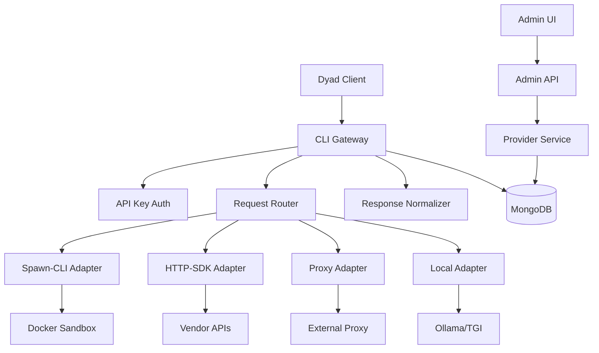

# Design Document — Dyad CLI Gateway (Improved)

## Overview

The **Dyad CLI Gateway** is a standalone Node.js/Express service that acts as a protocol translation layer between OpenAI‑compatible clients (e.g., Dyad) and a variety of AI providers (CLI agents, local model servers, vendor SDKs, and community proxies). It uses a pluggable adapter pattern, enforces security with containerized sandboxing, and presents a consistent OpenAI‑compatible `/v1` API surface.

This improved design adds explicit requirements for streaming semantics, OpenAPI contracts, error mapping, cancellation/timeout behavior, credential lifecycle, health/readiness endpoints, fallback/circuit‑breaker policy, and operational cautions for sandboxing.

---

## Architecture

### High-Level Architecture



### Service Architecture

Layers:

1. **API Layer** — Express routes for OpenAI endpoints and admin APIs (versioned: `/v1/`).
2. **Service Layer** — Gateway orchestration, provider lookup, routing, policy enforcement.
3. **Adapter Layer** — Pluggable adapters implementing a common contract (`handleChat`, `handleEmbeddings`, streaming support flag).
4. **Data Layer** — MongoDB (Provider, APIKey, Audit logs, Metrics).
5. **Security & Sandbox Layer** — API key auth, admin JWT, Docker/VM sandbox, secrets encryption.

### Deployment Modes

* **Standalone**: Gateway runs as an independent service (recommended for isolation).
* **Integrated**: Gateway mounted inside the existing backend process (optional for simpler ops).

---

## API Surface & OpenAPI Contract (summary)

**Versioning:** All endpoints under `/v1/`.

### Important endpoints (summary):

* `POST /v1/chat/completions` — OpenAI Chat schema, supports streaming (SSE) if adapter supports it.
* `GET /v1/models` — List models exposed by configured providers with metadata.
* `POST /v1/embeddings` — Forwarded to providers that support embeddings.
* `GET /healthz` — Liveness (simple `200 OK`).
* `GET /ready` — Readiness (checks DB + provider minimal checks).
* `POST /admin/providers` etc. — Provider CRUD & `POST /admin/providers/:id/test`.

> A full OpenAPI (YAML) spec should be generated from these contracts and kept in `md-docs/`.

**Example request (chat completions)**

```json
POST /v1/chat/completions
Authorization: Bearer <GATEWAY_API_KEY>
Content-Type: application/json
{
  "model": "gemini-2.5-pro",
  "messages": [{"role":"system","content":"You are helpful."},{"role":"user","content":"Write a haiku."}],
  "max_tokens": 128
}
```

**Example successful response (synchronous)** — OpenAI‑compatible minimal:

```json
{
  "id": "chatcmpl-abc123",
  "object": "chat.completion",
  "created": 1690000000,
  "model": "gemini-2.5-pro",
  "choices": [{"index":0,"message":{"role":"assistant","content":"Autumn winds whisper..."},"finish_reason":"stop"}],
  "usage": {"prompt_tokens":10,"completion_tokens":12,"total_tokens":22}
}
```

**Streaming semantics** (SSE recommended):

* When streaming, respond with `Content-Type: text/event-stream` and send JSON chunks prefixed with `data: ` corresponding to partial `delta` objects akin to OpenAI streaming. Close stream with `data: [DONE]`.
* Include `request_id` and `model` in initial/closing chunks.

---

## Components & Interfaces (improved)

### Gateway Service (`gateway.service.js`)

* `handleChatCompletion(req, apiKey, signal)` — orchestrates provider lookup, adapter invocation, error mapping, and normalization. Honors `signal` for cancellation.
* `getAvailableModels()` — aggregates model metadata (cached with TTL).
* `handleEmbeddings()` — routes to embedding-capable adapters.

### Provider Service (`provider.service.js`)

* CRUD, validation, encrypt/decrypt credentials, rotate credentials, periodic health checks. Persist providers in MongoDB.
* `testProvider(id, sampleRequest)` executes a dry-run or real test depending on `dryRun` flag.

### Adapter Interface (`adapter.interface.js`)

* `constructor(providerConfig, credentials)`
* `async handleChat({ messages, options, requestMeta, signal })` → supports streaming or single response
* `async handleEmbeddings({ input, options })`
* `supportsStreaming: boolean`

Adapters must document supported features: streaming, embeddings, max_tokens, context_window.

### Response Normalizer (`openai.normalizer.js`)

* `normalizeChatResponse(adapterResp, dyadModelId, requestId)`
* `normalizeError(err, requestId)` — maps internal/provider errors to OpenAI-style errors.
* `normalizeModels(providerDocs)` — returns metadata for `/v1/models`.

---

## Adapter Implementations

### Spawn‑CLI Adapter (`spawn-cli.adapter.js`) — recommended defaults

* **Behavior**: Launch CLI in sandboxed container, feed `messages` to stdin, parse stdout (prefer JSON lines), stream tokens if adapter provides them.
* **Sandboxing**: Docker runner with ephemeral container, resource limits, and read-only mounts by default.
* **Best practices**: do not interpolate user content into shell args; use `spawn(cmd, argsArray)` and pass content via stdin.

**Configuration (example)**

```json
{
  "command": "/usr/local/bin/gemini",
  "args": ["--json"],
  "dockerSandbox": true,
  "sandboxImage": "ghcr.io/org/cli-runner:latest",
  "timeoutSeconds": 60,
  "memoryLimit": "512m",
  "cpuLimit": "0.5"
}
```

### HTTP‑SDK Adapter (`http-sdk.adapter.js`)

* **Behavior**: Call vendor REST/SDK (e.g., Bedrock, Anthropic, Gemini API). Includes retry/backoff, token injection, request shaping.
* **Configuration**: `baseUrl`, `headers`, `retryAttempts`, `timeoutMs`.

### Proxy Adapter (`proxy.adapter.js`)

* **Behavior**: Forward requests to an external OpenAI‑compatible proxy (e.g., gemini-openai-proxy). Supports streaming passthrough and header rewriting.
* **Limits**: Must validate TOS and credentials usage.

### Local Adapter (`local.adapter.js`)

* **Behavior**: Forward to local servers (Ollama, TGI) that already speak OpenAI style. Should perform health checks and model discovery.

---

## Data Models (unchanged, with notes)

* **Provider**: store adapterConfig, encrypted credentials, model mapping, rate limits, healthStatus.
* **APIKey**: hashed keys, permissions, per-key quotas and rate limits.

**Notes**: Use field-level encryption for credentials; keep master key in KMS or environment with rotation support.

---

## Error Handling & Mapping (new table)

Map common conditions to OpenAI `type`/`code`:

| Condition              | HTTP | OpenAI `type`           | `code`                    |
| ---------------------- | ---: | ----------------------- | ------------------------- |
| Invalid input          |  400 | `invalid_request_error` | `invalid_request`         |
| Auth failure (API key) |  401 | `authentication_error`  | `invalid_api_key`         |
| Permission denied      |  403 | `permission_error`      | `forbidden`               |
| Model not found        |  404 | `invalid_request_error` | `model_not_found`         |
| Rate limit exceeded    |  429 | `rate_limit_error`      | `rate_limit_exceeded`     |
| Adapter timeout        |  504 | `internal_error`        | `adapter_timeout`         |
| Provider auth failure  |  502 | `invalid_request_error` | `provider_authentication` |
| Internal server error  |  500 | `internal_error`        | `internal_server_error`   |

All errors must include `request_id` and a short `trace_id` for debugging. Logs should capture stack traces and adapter context but redact PII.

---

## Streaming & Cancellation

**Streaming format**:

* Use **SSE** (`text/event-stream`) sending JSON `data:` chunks containing partial `delta` objects.
* Chunk example (pseudo):

  * `data: {"id":"req-1","model":"gemini-2.5-pro","choices":[{"delta":{"content":"Hel"}}],"type":"delta"}`
  * `data: {"id":"req-1","choices":[{"delta":{"content":"lo"}}],"type":"delta"}`
  * `data: [DONE]`

**Client cancellation & server cleanup**:

* When the client closes the connection or sends an abort signal, the request handler must cancel adapter execution via a cancellation `signal` and ensure sandboxed container/process is terminated within `killGracePeriod` (configurable).
* If cancellation fails, enforce hard kill after `hardKillTimeout`.

---

## Timeouts, Retries & Circuit Breaker

* **Per-call timeout** (default 60s) enforced at gateway; adapter may have its own sub-timeout.
* **Retries**: For idempotent HTTP SDK calls, use retry with exponential backoff (max attempts configurable); **do not** retry CLI executions that produced side effects unless in dry‑run mode.
* **Circuit Breaker**: For each provider, track failures; open circuit after `N` failures in `T` window, suppress calls to failing provider for `cooldown` period and mark health status `unhealthy`.
* **Fallback**: If provider has configured fallback providers for a `dyadModelId`, try them when primary fails and only if fallback is safe (no side effects).

---

## Security Enhancements

* **Transport**: Enforce TLS (HTTPS) for client ↔ gateway and gateway ↔ vendor connections.
* **Secrets**: Store provider credentials encrypted using a master key from KMS; support rotation endpoint `POST /admin/providers/:id/rotate-credentials`.
* **Sandboxing**: Avoid mounting host Docker socket in production. Prefer managed job runners, unprivileged runtime, or ephemeral VMs (Cloud Run / K8s Jobs) for executing CLIs.
* **Logging**: Redact PII and secrets from logs. Provide opt-in verbose logs for debugging in dev only.
* **TOS / Legal**: Document and require review before using reverse-engineered proxies (Copilot, Gemini CLI proxies).

---

## Health & Observability

* **Endpoints**: `/healthz` (liveness: returns `200`), `/ready` (readiness: checks DB + essential providers), `/metrics` (Prometheus metrics).
* **Metrics**: Requests/sec, latency histogram, adapter success/failure counts, queue length, container resource usage.
* **Tracing**: Correlate requests with `request_id`, propagate to adapter calls and vendor requests.
* **Audit logs**: Admin actions (create/update/delete provider, credential rotation) recorded with `userId`, timestamp, and change diff.

---

## Testing Strategy (expanded)

* Unit tests for adapters with mocks (`child_process`, `axios`, `dockerode` mocks).
* Integration tests: run test Docker sandbox images in CI (limited), use mocked vendor endpoints for HTTP adapters.
* E2E: register provider, run `POST /admin/providers/:id/test`, then `POST /v1/chat/completions`.
* Security tests: container breakout attempts, injection tests, rate limit stress.
* Performance: load tests for typical Dyad workloads (e.g., 50 req/s with small prompts).

---

## Operational & Deployment Notes

* **Docker socket**: Avoid `/var/run/docker.sock` mount in prod; if unavoidable, lock down host. Consider K8s Job runner with fine RBAC.
* **Scaling**: Gateway is stateless for request routing — scale horizontally. Use centralized storage for provider configs (MongoDB) and centralized metrics.
* **Secrets**: Use a secret manager (AWS KMS / HashiCorp Vault) and do not store raw API keys in DB.
* **Backups & Migrations**: Plan provider config migrations and backups — keep model mapping stable to avoid breaking Dyad configs.

---

## OpenAPI & Client SDKs (next step)

* Generate a full OpenAPI v3 spec (YAML) from the endpoint contracts above and commit to `md-docs/openapi.yaml`.
* Optionally generate a TypeScript client for the admin UI and integration tests.

---

## Next Steps / Implementation Roadmap

1. Produce OpenAPI spec and model JSON schemas. (blocker for frontend)
2. Implement M1 PoC: `/v1/chat/completions` + `spawn-cli` echo adapter + `/v1/models`.
3. Implement provider persistence & admin CRUD. Add `POST /admin/providers/:id/test`.
4. Add sandbox runner (Docker job) + timeout/cancellation support.
5. Implement HTTP‑SDK adapter for one vendor (Gemini API or Bedrock gateway).
6. Add streaming support (SSE) end‑to‑end.
7. Add circuit breaker, rate limits, and health checks.
8. CI: unit/integration tests + docker image build + security checks.

---

## Appendix: Quick examples

* **Provider config (spawn-cli) — sample**

```json
{
  "name": "gemini-cli-local",
  "slug": "gemini-cli-local",
  "type": "spawn-cli",
  "models": [{"dyadModelId":"gemini-2.5-pro","adapterModelId":"gemini-cli-v2","maxTokens":4096}],
  "adapterConfig": {"command":"/usr/local/bin/gemini","args":["--json"],"dockerSandbox":true}
}
```

* **Error mapping example**

```
Adapter timeout -> 504 -> { type: 'internal_error', code: 'adapter_timeout' }
```

---