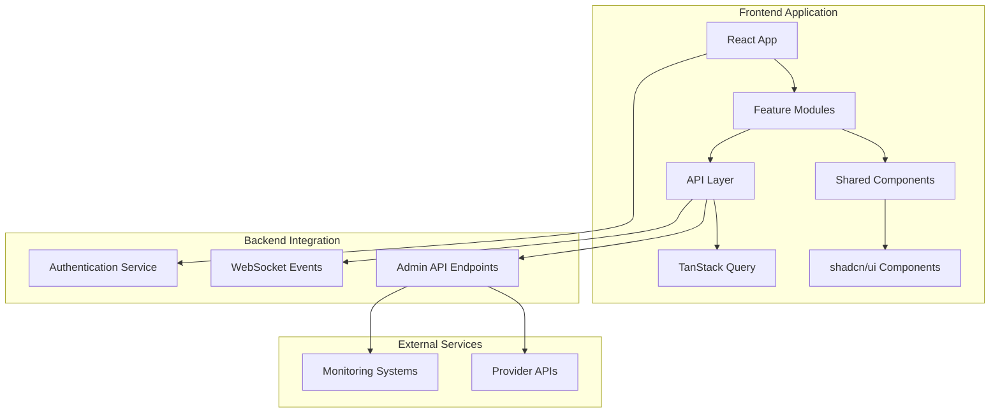
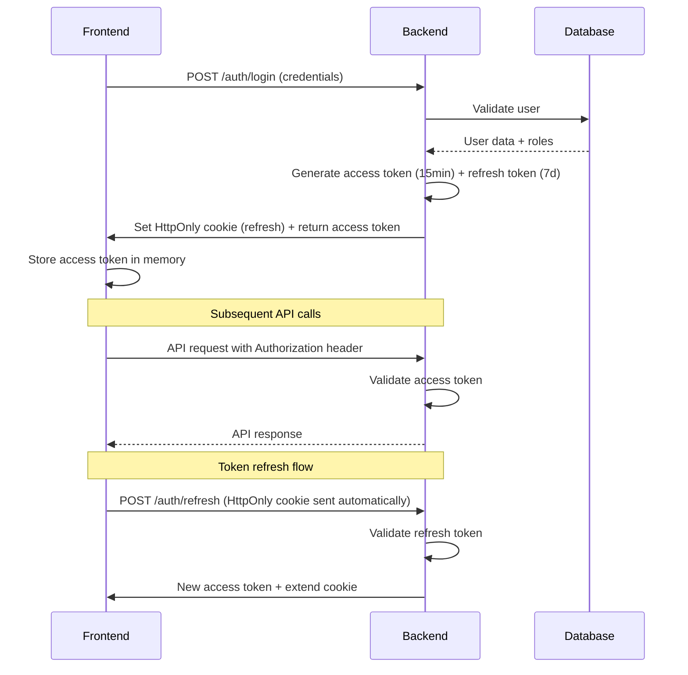

# Design Document

## Overview

The Frontend Admin UI for the Dyad CLI Gateway is a comprehensive React-based web application that provides administrators with a modern, accessible interface for managing AI providers, monitoring system health, and configuring gateway settings. The application follows a feature-based architecture with TypeScript, leverages the existing shadcn/ui component library, and integrates seamlessly with the backend admin API endpoints.

The design emphasizes user experience, performance, and maintainability while providing real-time monitoring capabilities and intuitive provider management workflows.

## Architecture

### High-Level Architecture



### Technology Stack

- **Framework**: React 18 with TypeScript
- **Build Tool**: Vite with SWC plugin
- **State Management**: TanStack Query for server state, React Context for client state
- **UI Components**: shadcn/ui with Radix UI primitives
- **Styling**: Tailwind CSS with CSS variables for theming
- **Forms**: React Hook Form with Zod validation
- **Routing**: React Router DOM v6
- **Testing**: Vitest + React Testing Library + Playwright
- **HTTP Client**: Axios with interceptors

### Feature-Based Structure

```
frontend/src/
├── features/
│   ├── providers/          # Provider management
│   ├── api-keys/          # API key management
│   ├── monitoring/        # System monitoring
│   ├── chat-playground/   # Interactive testing
│   └── settings/          # System settings
├── shared/
│   ├── components/        # Reusable UI components
│   ├── hooks/            # Custom React hooks
│   ├── services/         # API services
│   ├── types/            # TypeScript definitions
│   └── utils/            # Utility functions
└── app/
    ├── layout/           # Application layout
    ├── routing/          # Route configuration
    └── providers/        # Context providers
```

## Components and Interfaces

### Core Feature Components

#### Provider Management
```typescript
// Provider List Component
interface ProviderListProps {
  providers: Provider[];
  onEdit: (id: string) => void;
  onDelete: (id: string) => void;
  onTest: (id: string) => void;
  onToggleEnabled: (id: string, enabled: boolean) => void;
}

// Provider Form Component
interface ProviderFormProps {
  provider?: Provider;
  onSubmit: (data: ProviderFormData) => Promise<void>;
  onCancel: () => void;
  mode: 'create' | 'edit';
}

// Adapter Config Editor
interface AdapterConfigEditorProps {
  type: ProviderType;
  config: Record<string, any>;
  onChange: (config: Record<string, any>) => void;
  errors?: Record<string, string>;
}
```

#### Monitoring Dashboard
```typescript
// Health Status Component
interface HealthStatusProps {
  providers: Provider[];
  systemMetrics: SystemMetrics;
  refreshInterval?: number;
}

// Metrics Chart Component
interface MetricsChartProps {
  data: MetricDataPoint[];
  type: 'requests' | 'errors' | 'latency';
  timeRange: TimeRange;
  onTimeRangeChange: (range: TimeRange) => void;
}

// Logs Viewer Component
interface LogsViewerProps {
  providerId?: string;
  logs: LogEntry[];
  isStreaming?: boolean;
  onToggleStreaming?: (enabled: boolean) => void;
}
```

#### Chat Playground with Streaming Support
```typescript
// Streaming Chat Interface
interface ChatInterfaceProps {
  selectedModel: string;
  onModelChange: (model: string) => void;
  onSendMessage: (message: string) => Promise<void>;
  conversation: ChatMessage[];
  isLoading: boolean;
  isStreaming: boolean;
  onCancelStream?: () => void;
}

// Streaming Response Handler
interface StreamingResponse {
  content: string;
  isComplete: boolean;
  error?: string;
}

const useStreamingChat = () => {
  const [streamingResponse, setStreamingResponse] = useState<StreamingResponse | null>(null);
  const abortControllerRef = useRef<AbortController | null>(null);
  
  const sendStreamingMessage = useCallback(async (message: string, model: string) => {
    // Cancel any existing stream
    if (abortControllerRef.current) {
      abortControllerRef.current.abort();
    }
    
    abortControllerRef.current = new AbortController();
    setStreamingResponse({ content: '', isComplete: false });
    
    try {
      const response = await fetch('/api/v1/chat/completions', {
        method: 'POST',
        headers: {
          'Content-Type': 'application/json',
          'Authorization': `Bearer ${getAccessToken()}`,
        },
        body: JSON.stringify({
          model,
          messages: [{ role: 'user', content: message }],
          stream: true,
        }),
        signal: abortControllerRef.current.signal,
      });
      
      if (!response.ok) {
        throw new Error(`HTTP ${response.status}: ${response.statusText}`);
      }
      
      const reader = response.body?.getReader();
      if (!reader) throw new Error('No response body');
      
      const decoder = new TextDecoder();
      let buffer = '';
      
      while (true) {
        const { done, value } = await reader.read();
        
        if (done) {
          setStreamingResponse(prev => prev ? { ...prev, isComplete: true } : null);
          break;
        }
        
        buffer += decoder.decode(value, { stream: true });
        const lines = buffer.split('\n');
        buffer = lines.pop() || '';
        
        for (const line of lines) {
          if (line.startsWith('data: ')) {
            const data = line.slice(6);
            if (data === '[DONE]') {
              setStreamingResponse(prev => prev ? { ...prev, isComplete: true } : null);
              return;
            }
            
            try {
              const parsed = JSON.parse(data);
              const content = parsed.choices?.[0]?.delta?.content || '';
              
              setStreamingResponse(prev => ({
                content: (prev?.content || '') + content,
                isComplete: false,
              }));
            } catch (parseError) {
              console.warn('Failed to parse streaming data:', data);
            }
          }
        }
      }
    } catch (error) {
      if (error.name === 'AbortError') {
        setStreamingResponse(prev => prev ? { ...prev, isComplete: true } : null);
      } else {
        setStreamingResponse({
          content: '',
          isComplete: true,
          error: error.message,
        });
      }
    }
  }, []);
  
  const cancelStream = useCallback(() => {
    if (abortControllerRef.current) {
      abortControllerRef.current.abort();
    }
  }, []);
  
  return { streamingResponse, sendStreamingMessage, cancelStream };
};

// Streaming Chat UI Component
const StreamingChatMessage: React.FC<{ response: StreamingResponse }> = ({ response }) => {
  return (
    <div className="chat-message assistant">
      <div className="message-content">
        {response.error ? (
          <div className="error-message">
            <AlertCircle className="w-4 h-4 mr-2" />
            Error: {response.error}
          </div>
        ) : (
          <>
            <div className="streaming-content">
              {response.content}
              {!response.isComplete && (
                <span className="cursor animate-pulse">▊</span>
              )}
            </div>
            {!response.isComplete && (
              <Button
                variant="outline"
                size="sm"
                onClick={() => cancelStream()}
                className="mt-2"
              >
                <Square className="w-3 h-3 mr-1" />
                Cancel
              </Button>
            )}
          </>
        )}
      </div>
    </div>
  );
};

// Request Inspector Component with Streaming Details
interface RequestInspectorProps {
  request: ChatRequest;
  response: ChatResponse;
  metadata: RequestMetadata;
  streamingData?: {
    chunks: string[];
    totalTime: number;
    firstTokenTime: number;
  };
  onExport: () => void;
}
```

### Shared Components

#### Layout Components
```typescript
// Main Layout
interface MainLayoutProps {
  children: React.ReactNode;
  sidebar?: React.ReactNode;
  header?: React.ReactNode;
}

// Page Header
interface PageHeaderProps {
  title: string;
  description?: string;
  actions?: React.ReactNode;
  breadcrumbs?: BreadcrumbItem[];
}

// Data Table
interface DataTableProps<T> {
  data: T[];
  columns: ColumnDef<T>[];
  pagination?: PaginationConfig;
  sorting?: SortingConfig;
  filtering?: FilteringConfig;
  onRowAction?: (action: string, row: T) => void;
}
```

#### Form Components
```typescript
// Dynamic Form Field
interface DynamicFormFieldProps {
  name: string;
  type: FieldType;
  label: string;
  description?: string;
  required?: boolean;
  validation?: ZodSchema;
  dependsOn?: string;
  showWhen?: (values: any) => boolean;
}

// Confirmation Dialog
interface ConfirmationDialogProps {
  open: boolean;
  title: string;
  description: string;
  confirmText?: string;
  cancelText?: string;
  variant?: 'default' | 'destructive';
  onConfirm: () => void;
  onCancel: () => void;
}
```

## Data Models

### Core Types
```typescript
// Provider Types
type ProviderType = 'spawn-cli' | 'http-sdk' | 'proxy' | 'local';

interface Provider {
  _id: string;
  name: string;
  slug: string;
  type: ProviderType;
  description?: string;
  enabled: boolean;
  adapterConfig: AdapterConfig;
  credentials?: Record<string, string>;
  models: ModelMapping[];
  healthStatus: HealthStatus;
  createdAt: string;
  updatedAt: string;
}

interface ModelMapping {
  dyadModelId: string;
  adapterModelId: string;
  maxTokens?: number;
  contextWindow?: number;
  costPerToken?: number;
}

// Adapter Configurations
interface SpawnCliConfig {
  command: string;
  args: string[];
  dockerSandbox?: boolean;
  sandboxImage?: string;
  timeoutSeconds?: number;
  workingDirectory?: string;
  environmentVariables?: Record<string, string>;
}

interface HttpSdkConfig {
  baseUrl: string;
  authType: 'api-key' | 'oauth' | 'aws-role';
  region?: string;
  modelPrefix?: string;
  headers?: Record<string, string>;
  timeout?: number;
}

interface ProxyConfig {
  proxyBaseUrl: string;
  apiKeyHeaderName: string;
  forwardHeaders?: string[];
  transformRequest?: boolean;
  transformResponse?: boolean;
}

interface LocalConfig {
  endpoint: string;
  protocol: 'http' | 'grpc';
  modelPath?: string;
  maxConcurrentRequests?: number;
}

type AdapterConfig = SpawnCliConfig | HttpSdkConfig | ProxyConfig | LocalConfig;
```

### API Response Types
```typescript
// API Response Wrappers
interface ApiResponse<T> {
  success: boolean;
  data: T;
  message?: string;
  errors?: Record<string, string>;
}

interface PaginatedResponse<T> {
  results: T[];
  totalResults: number;
  page: number;
  totalPages: number;
  limit: number;
}

// Test Results
interface TestResult {
  success: boolean;
  latency: number;
  request: ChatRequest;
  response?: ChatResponse;
  error?: string;
  logs: LogEntry[];
  timestamp: string;
}

// System Metrics
interface SystemMetrics {
  totalRequests: number;
  successRate: number;
  averageLatency: number;
  activeProviders: number;
  errorRate: number;
  uptime: number;
}

interface MetricDataPoint {
  timestamp: string;
  value: number;
  label?: string;
}
```

### Form Schemas
```typescript
// Zod Validation Schemas
const providerBaseSchema = z.object({
  name: z.string().min(1, 'Name is required').max(100),
  slug: z.string().regex(/^[a-z0-9-]+$/, 'Slug must be lowercase with hyphens'),
  type: z.enum(['spawn-cli', 'http-sdk', 'proxy', 'local']),
  description: z.string().optional(),
  enabled: z.boolean().default(true),
});

const spawnCliConfigSchema = z.object({
  command: z.string().min(1, 'Command is required'),
  args: z.array(z.string()).default([]),
  dockerSandbox: z.boolean().default(false),
  sandboxImage: z.string().optional(),
  timeoutSeconds: z.number().min(1).max(300).default(30),
});

const modelMappingSchema = z.object({
  dyadModelId: z.string().min(1, 'Dyad model ID is required'),
  adapterModelId: z.string().min(1, 'Adapter model ID is required'),
  maxTokens: z.number().positive().optional(),
  contextWindow: z.number().positive().optional(),
});

// Dynamic schema based on provider type
const createProviderSchema = (type: ProviderType) => {
  const configSchema = {
    'spawn-cli': spawnCliConfigSchema,
    'http-sdk': httpSdkConfigSchema,
    'proxy': proxyConfigSchema,
    'local': localConfigSchema,
  }[type];

  return providerBaseSchema.extend({
    adapterConfig: configSchema,
    models: z.array(modelMappingSchema).min(1, 'At least one model mapping is required'),
  });
};
```

## Security Considerations

### Frontend Security Measures
```typescript
// CSRF Protection
interface CSRFConfig {
  tokenHeaderName: string;
  cookieName: string;
  enabled: boolean;
}

const csrfConfig: CSRFConfig = {
  tokenHeaderName: 'X-CSRF-Token',
  cookieName: 'csrf-token',
  enabled: process.env.NODE_ENV === 'production',
};

// Content Sanitization
import DOMPurify from 'dompurify';

const sanitizeContent = (content: string): string => {
  return DOMPurify.sanitize(content, {
    ALLOWED_TAGS: ['p', 'br', 'strong', 'em', 'code', 'pre'],
    ALLOWED_ATTR: ['class'],
  });
};

// Secure Log Rendering
const LogEntry: React.FC<{ entry: LogEntry }> = ({ entry }) => {
  const sanitizedMessage = sanitizeContent(entry.message);
  
  return (
    <div className="log-entry">
      <span className="timestamp">{entry.timestamp}</span>
      <span 
        className="message"
        dangerouslySetInnerHTML={{ __html: sanitizedMessage }}
      />
    </div>
  );
};

// Input Validation
const validateInput = (input: string, type: 'command' | 'url' | 'text'): boolean => {
  const patterns = {
    command: /^[a-zA-Z0-9\-_./\s]+$/,
    url: /^https?:\/\/[^\s<>"{}|\\^`[\]]+$/,
    text: /^[^<>{}]*$/,
  };
  
  return patterns[type].test(input);
};
```

### Authentication & Authorization

#### Secure Authentication Flow


```typescript
// Production-Ready Token Management
interface AuthTokens {
  accessToken: string;
  expiresAt: number;
}

class AuthManager {
  private tokens: AuthTokens | null = null;
  private refreshPromise: Promise<AuthTokens> | null = null;
  
  // Access token stored in memory only
  setTokens(accessToken: string, expiresIn: number): void {
    this.tokens = {
      accessToken,
      expiresAt: Date.now() + (expiresIn * 1000),
    };
  }
  
  getAccessToken(): string | null {
    if (!this.tokens || this.isTokenExpired()) {
      return null;
    }
    return this.tokens.accessToken;
  }
  
  private isTokenExpired(): boolean {
    return this.tokens ? Date.now() >= this.tokens.expiresAt - 30000 : true; // 30s buffer
  }
  
  // Refresh token is handled via HttpOnly cookie
  async refreshTokens(): Promise<AuthTokens> {
    if (this.refreshPromise) {
      return this.refreshPromise;
    }
    
    this.refreshPromise = fetch('/api/v1/auth/refresh', {
      method: 'POST',
      credentials: 'include', // Include HttpOnly cookie
      headers: {
        'X-CSRF-Token': this.getCSRFToken(),
      },
    })
    .then(response => {
      if (!response.ok) throw new Error('Refresh failed');
      return response.json();
    })
    .then(data => {
      this.setTokens(data.accessToken, data.expiresIn);
      return this.tokens!;
    })
    .finally(() => {
      this.refreshPromise = null;
    });
    
    return this.refreshPromise;
  }
  
  private getCSRFToken(): string {
    return document.querySelector('meta[name="csrf-token"]')?.getAttribute('content') || '';
  }
}

// Axios Interceptor with Auto-Refresh
const setupAuthInterceptors = (authManager: AuthManager) => {
  // Request interceptor
  apiClient.interceptors.request.use(async (config) => {
    let token = authManager.getAccessToken();
    
    // Auto-refresh if token is expired
    if (!token) {
      try {
        await authManager.refreshTokens();
        token = authManager.getAccessToken();
      } catch (error) {
        // Redirect to login if refresh fails
        window.location.href = '/login';
        throw error;
      }
    }
    
    if (token) {
      config.headers.Authorization = `Bearer ${token}`;
    }
    
    // Add CSRF token for state-changing operations
    if (['post', 'put', 'patch', 'delete'].includes(config.method?.toLowerCase() || '')) {
      config.headers['X-CSRF-Token'] = authManager.getCSRFToken();
    }
    
    return config;
  });
  
  // Response interceptor for 401 handling
  apiClient.interceptors.response.use(
    (response) => response,
    async (error) => {
      if (error.response?.status === 401 && !error.config._retry) {
        error.config._retry = true;
        try {
          await authManager.refreshTokens();
          const token = authManager.getAccessToken();
          error.config.headers.Authorization = `Bearer ${token}`;
          return apiClient.request(error.config);
        } catch (refreshError) {
          window.location.href = '/login';
        }
      }
      return Promise.reject(error);
    }
  );
};

// Role-based Route Protection with Loading States
const ProtectedRoute: React.FC<{ 
  children: React.ReactNode; 
  requiredRole: string;
  fallback?: React.ReactNode;
}> = ({ children, requiredRole, fallback }) => {
  const { user, isLoading, error } = useAuth();
  
  if (isLoading) {
    return (
      <div className="flex items-center justify-center min-h-screen">
        <Spinner className="w-8 h-8" />
        <span className="ml-2">Verifying access...</span>
      </div>
    );
  }
  
  if (error) {
    return <Navigate to="/login" state={{ from: location.pathname }} replace />;
  }
  
  if (!user || !user.roles.includes(requiredRole)) {
    return fallback || <Navigate to="/unauthorized" replace />;
  }
  
  return <>{children}</>;
};
```

## Accessibility & Internationalization

### Accessibility Implementation

#### Comprehensive A11y Checklist & Testing
```typescript
// Accessibility Testing Suite
import { axe, toHaveNoViolations } from 'jest-axe';
import { render, screen } from '@testing-library/react';
import userEvent from '@testing-library/user-event';

expect.extend(toHaveNoViolations);

// Automated A11y Testing
describe('Accessibility Compliance', () => {
  const components = [
    { name: 'ProviderForm', component: ProviderForm },
    { name: 'ProviderList', component: ProviderList },
    { name: 'ChatPlayground', component: ChatPlayground },
    { name: 'MonitoringDashboard', component: MonitoringDashboard },
  ];
  
  components.forEach(({ name, component: Component }) => {
    describe(name, () => {
      it('should not have accessibility violations', async () => {
        const { container } = render(<Component />);
        const results = await axe(container);
        expect(results).toHaveNoViolations();
      });
      
      it('should have proper heading hierarchy', () => {
        render(<Component />);
        const headings = screen.getAllByRole('heading');
        
        // Check heading levels are sequential (h1 -> h2 -> h3, etc.)
        let previousLevel = 0;
        headings.forEach(heading => {
          const level = parseInt(heading.tagName.charAt(1));
          expect(level).toBeLessThanOrEqual(previousLevel + 1);
          previousLevel = level;
        });
      });
      
      it('should have proper landmark roles', () => {
        render(<Component />);
        
        // Check for main content area
        expect(screen.getByRole('main')).toBeInTheDocument();
        
        // Check for navigation if present
        const nav = screen.queryByRole('navigation');
        if (nav) {
          expect(nav).toHaveAttribute('aria-label');
        }
      });
      
      it('should support keyboard navigation', async () => {
        const user = userEvent.setup();
        render(<Component />);
        
        // Tab through all interactive elements
        const interactiveElements = screen.getAllByRole(/button|link|textbox|combobox|checkbox|radio/);
        
        for (const element of interactiveElements) {
          await user.tab();
          if (document.activeElement === element) {
            expect(element).toBeVisible();
          }
        }
      });
    });
  });
});

// A11y Checklist Implementation
interface AccessibilityChecklist {
  labels: boolean;           // All form controls have labels
  landmarks: boolean;        // Proper landmark roles (main, nav, aside)
  headings: boolean;         // Logical heading hierarchy
  focusOrder: boolean;       // Logical tab order
  keyboardTraps: boolean;    // No keyboard traps
  colorContrast: boolean;    // WCAG AA color contrast
  altText: boolean;          // Images have alt text
  ariaLabels: boolean;       // Interactive elements have accessible names
  liveRegions: boolean;      // Dynamic content uses aria-live
  skipLinks: boolean;        // Skip navigation links present
}

const useAccessibilityAudit = () => {
  const [checklist, setChecklist] = useState<AccessibilityChecklist>({
    labels: false,
    landmarks: false,
    headings: false,
    focusOrder: false,
    keyboardTraps: false,
    colorContrast: false,
    altText: false,
    ariaLabels: false,
    liveRegions: false,
    skipLinks: false,
  });
  
  const runAudit = useCallback(async () => {
    const results = await axe(document.body);
    
    // Process axe results to update checklist
    const violations = results.violations;
    
    setChecklist({
      labels: !violations.some(v => v.id === 'label'),
      landmarks: !violations.some(v => v.id.includes('landmark')),
      headings: !violations.some(v => v.id.includes('heading')),
      focusOrder: !violations.some(v => v.id === 'focus-order-semantics'),
      keyboardTraps: !violations.some(v => v.id === 'focus-trap'),
      colorContrast: !violations.some(v => v.id === 'color-contrast'),
      altText: !violations.some(v => v.id === 'image-alt'),
      ariaLabels: !violations.some(v => v.id.includes('aria-label')),
      liveRegions: !violations.some(v => v.id === 'aria-live'),
      skipLinks: !violations.some(v => v.id === 'skip-link'),
    });
  }, []);
  
  return { checklist, runAudit };
};

// Enhanced Keyboard Navigation
const useKeyboardNavigation = (items: any[], onSelect: (item: any) => void) => {
  const [focusedIndex, setFocusedIndex] = useState(0);
  const listRef = useRef<HTMLDivElement>(null);
  const itemRefs = useRef<(HTMLElement | null)[]>([]);
  
  // Ensure focus is visible
  useEffect(() => {
    const focusedElement = itemRefs.current[focusedIndex];
    if (focusedElement) {
      focusedElement.scrollIntoView({ block: 'nearest' });
      focusedElement.focus();
    }
  }, [focusedIndex]);
  
  useEffect(() => {
    const handleKeyDown = (e: KeyboardEvent) => {
      switch (e.key) {
        case 'ArrowDown':
          e.preventDefault();
          setFocusedIndex(prev => Math.min(prev + 1, items.length - 1));
          break;
        case 'ArrowUp':
          e.preventDefault();
          setFocusedIndex(prev => Math.max(prev - 1, 0));
          break;
        case 'Home':
          e.preventDefault();
          setFocusedIndex(0);
          break;
        case 'End':
          e.preventDefault();
          setFocusedIndex(items.length - 1);
          break;
        case 'Enter':
        case ' ':
          e.preventDefault();
          onSelect(items[focusedIndex]);
          break;
        case 'Escape':
          e.preventDefault();
          listRef.current?.blur();
          break;
      }
    };
    
    const element = listRef.current;
    element?.addEventListener('keydown', handleKeyDown);
    return () => element?.removeEventListener('keydown', handleKeyDown);
  }, [items, focusedIndex, onSelect]);
  
  return { 
    focusedIndex, 
    listRef, 
    itemRefs: (index: number) => (el: HTMLElement | null) => {
      itemRefs.current[index] = el;
    }
  };
};

// Screen Reader Announcements with Context
const useAnnouncements = () => {
  const announce = useCallback((
    message: string, 
    priority: 'polite' | 'assertive' = 'polite',
    context?: string
  ) => {
    const announcement = document.createElement('div');
    announcement.setAttribute('aria-live', priority);
    announcement.setAttribute('aria-atomic', 'true');
    announcement.className = 'sr-only';
    
    // Add context for better understanding
    const fullMessage = context ? `${context}: ${message}` : message;
    announcement.textContent = fullMessage;
    
    document.body.appendChild(announcement);
    
    // Clean up after announcement
    setTimeout(() => {
      if (document.body.contains(announcement)) {
        document.body.removeChild(announcement);
      }
    }, 1000);
  }, []);
  
  return { announce };
};

// Focus Management for Modals and Dialogs
const useFocusTrap = (isActive: boolean) => {
  const containerRef = useRef<HTMLElement>(null);
  const previousFocusRef = useRef<HTMLElement | null>(null);
  
  useEffect(() => {
    if (!isActive || !containerRef.current) return;
    
    // Store the previously focused element
    previousFocusRef.current = document.activeElement as HTMLElement;
    
    // Get all focusable elements within the container
    const focusableElements = containerRef.current.querySelectorAll(
      'button, [href], input, select, textarea, [tabindex]:not([tabindex="-1"])'
    ) as NodeListOf<HTMLElement>;
    
    const firstElement = focusableElements[0];
    const lastElement = focusableElements[focusableElements.length - 1];
    
    // Focus the first element
    firstElement?.focus();
    
    const handleTabKey = (e: KeyboardEvent) => {
      if (e.key !== 'Tab') return;
      
      if (e.shiftKey) {
        // Shift + Tab
        if (document.activeElement === firstElement) {
          e.preventDefault();
          lastElement?.focus();
        }
      } else {
        // Tab
        if (document.activeElement === lastElement) {
          e.preventDefault();
          firstElement?.focus();
        }
      }
    };
    
    document.addEventListener('keydown', handleTabKey);
    
    return () => {
      document.removeEventListener('keydown', handleTabKey);
      // Restore focus to the previously focused element
      previousFocusRef.current?.focus();
    };
  }, [isActive]);
  
  return containerRef;
};

// CI Integration for A11y Testing
// .github/workflows/accessibility.yml
const accessibilityWorkflow = `
name: Accessibility Tests

on: [push, pull_request]

jobs:
  a11y-tests:
    runs-on: ubuntu-latest
    steps:
      - uses: actions/checkout@v3
      - uses: actions/setup-node@v3
        with:
          node-version: '18'
      - run: npm ci
      - run: npm run test:a11y
      - run: npm run build
      - name: Run axe-core tests
        run: |
          npm start &
          sleep 10
          npx @axe-core/cli http://localhost:3000 --exit
`;
```

### Theme System
```typescript
// Theme Configuration
interface ThemeConfig {
  mode: 'light' | 'dark' | 'system';
  colors: {
    primary: string;
    secondary: string;
    accent: string;
    background: string;
    foreground: string;
  };
  accessibility: {
    highContrast: boolean;
    reducedMotion: boolean;
    fontSize: 'small' | 'medium' | 'large';
  };
}

const useTheme = () => {
  const [theme, setTheme] = useState<ThemeConfig>(() => {
    const saved = localStorage.getItem('dyad-theme');
    return saved ? JSON.parse(saved) : getDefaultTheme();
  });
  
  useEffect(() => {
    // Apply theme to document
    const root = document.documentElement;
    Object.entries(theme.colors).forEach(([key, value]) => {
      root.style.setProperty(`--color-${key}`, value);
    });
    
    // Apply accessibility preferences
    if (theme.accessibility.reducedMotion) {
      root.style.setProperty('--animation-duration', '0ms');
    }
    
    root.className = `theme-${theme.mode} ${theme.accessibility.highContrast ? 'high-contrast' : ''}`;
  }, [theme]);
  
  return { theme, setTheme };
};

// Internationalization Setup
interface I18nConfig {
  locale: string;
  messages: Record<string, string>;
  rtl: boolean;
}

const useI18n = () => {
  const [config, setConfig] = useState<I18nConfig>(() => ({
    locale: navigator.language.split('-')[0] || 'en',
    messages: {},
    rtl: false,
  }));
  
  const t = useCallback((key: string, params?: Record<string, string>) => {
    let message = config.messages[key] || key;
    
    if (params) {
      Object.entries(params).forEach(([param, value]) => {
        message = message.replace(`{{${param}}}`, value);
      });
    }
    
    return message;
  }, [config.messages]);
  
  return { t, locale: config.locale, rtl: config.rtl };
};
```

## Observability & Monitoring

### Frontend Monitoring Integration
```typescript
// Error Tracking with Sentry
import * as Sentry from '@sentry/react';

Sentry.init({
  dsn: process.env.VITE_SENTRY_DSN,
  environment: process.env.NODE_ENV,
  integrations: [
    new Sentry.BrowserTracing(),
    new Sentry.Replay(),
  ],
  tracesSampleRate: process.env.NODE_ENV === 'production' ? 0.1 : 1.0,
  replaysSessionSampleRate: 0.1,
  replaysOnErrorSampleRate: 1.0,
});

// Performance Monitoring
import { getCLS, getFID, getFCP, getLCP, getTTFB } from 'web-vitals';

const reportWebVitals = (metric: Metric) => {
  // Send to analytics service
  analytics.track('web-vital', {
    name: metric.name,
    value: metric.value,
    id: metric.id,
    url: window.location.pathname,
  });
  
  // Send to Sentry for performance monitoring
  Sentry.addBreadcrumb({
    category: 'web-vital',
    message: `${metric.name}: ${metric.value}`,
    level: 'info',
  });
};

// Initialize web vitals tracking
getCLS(reportWebVitals);
getFID(reportWebVitals);
getFCP(reportWebVitals);
getLCP(reportWebVitals);
getTTFB(reportWebVitals);

// Custom Performance Tracking
const usePerformanceTracking = () => {
  const trackUserAction = useCallback((action: string, metadata?: Record<string, any>) => {
    const startTime = performance.now();
    
    return {
      end: () => {
        const duration = performance.now() - startTime;
        analytics.track('user-action', {
          action,
          duration,
          ...metadata,
        });
      },
    };
  }, []);
  
  return { trackUserAction };
};
```

### Progressive Enhancement & Offline Support
```typescript
// Service Worker Registration
const registerServiceWorker = async () => {
  if ('serviceWorker' in navigator && process.env.NODE_ENV === 'production') {
    try {
      const registration = await navigator.serviceWorker.register('/sw.js');
      console.log('SW registered: ', registration);
    } catch (registrationError) {
      console.log('SW registration failed: ', registrationError);
    }
  }
};

// Offline Detection
const useOnlineStatus = () => {
  const [isOnline, setIsOnline] = useState(navigator.onLine);
  
  useEffect(() => {
    const handleOnline = () => setIsOnline(true);
    const handleOffline = () => setIsOnline(false);
    
    window.addEventListener('online', handleOnline);
    window.addEventListener('offline', handleOffline);
    
    return () => {
      window.removeEventListener('online', handleOnline);
      window.removeEventListener('offline', handleOffline);
    };
  }, []);
  
  return isOnline;
};

// Query Persistence for Offline Support
const queryClient = new QueryClient({
  defaultOptions: {
    queries: {
      staleTime: 5 * 60 * 1000, // 5 minutes
      cacheTime: 10 * 60 * 1000, // 10 minutes
      retry: (failureCount, error) => {
        // Don't retry on 4xx errors
        if (error instanceof Error && 'status' in error && error.status >= 400 && error.status < 500) {
          return false;
        }
        return failureCount < 3;
      },
    },
  },
});

// Persist queries to localStorage
import { persistQueryClient } from '@tanstack/react-query-persist-client-core';
import { createSyncStoragePersister } from '@tanstack/query-sync-storage-persister';

const localStoragePersister = createSyncStoragePersister({
  storage: window.localStorage,
});

persistQueryClient({
  queryClient,
  persister: localStoragePersister,
  maxAge: 24 * 60 * 60 * 1000, // 24 hours
});
```

### OpenAPI-Driven Client Generation

#### Contract-First Development
```typescript
// Generated from md-docs/openapi.yaml
import { AdminApi, Configuration } from './generated/admin-api';

const apiConfig = new Configuration({
  basePath: '/api/v1',
  accessToken: () => authManager.getAccessToken() || '',
});

export const adminApi = new AdminApi(apiConfig);

// Type-safe API calls with generated interfaces
export const useProviders = () => {
  return useQuery({
    queryKey: ['providers'],
    queryFn: () => adminApi.listProviders(),
    select: (response) => response.data,
  });
};

export const useCreateProvider = () => {
  const queryClient = useQueryClient();
  
  return useMutation({
    mutationFn: (provider: CreateProviderRequest) => 
      adminApi.createProvider({ createProviderRequest: provider }),
    onSuccess: () => {
      queryClient.invalidateQueries(['providers']);
      toast.success('Provider created successfully');
    },
    onError: (error: ApiError) => {
      toast.error(`Failed to create provider: ${error.message}`);
    },
  });
};

// Contract Testing
describe('API Contract Tests', () => {
  it('should match OpenAPI schema for provider creation', async () => {
    const mockProvider = {
      name: 'Test Provider',
      type: 'spawn-cli',
      adapterConfig: { command: 'echo', args: [] },
      models: [{ dyadModelId: 'test', adapterModelId: 'echo' }],
    };
    
    // Validate request against OpenAPI schema
    const isValid = await validateAgainstSchema('CreateProviderRequest', mockProvider);
    expect(isValid).toBe(true);
    
    // Make actual API call
    const response = await adminApi.createProvider({ createProviderRequest: mockProvider });
    
    // Validate response against OpenAPI schema
    const responseValid = await validateAgainstSchema('Provider', response.data);
    expect(responseValid).toBe(true);
  });
});
```

### API Versioning & Graceful Degradation

#### Feature Flags with Fallback UI
```typescript
// Enhanced Feature Flag System
interface FeatureFlags {
  realTimeUpdates: boolean;
  advancedAnalytics: boolean;
  batchOperations: boolean;
  chatPlayground: boolean;
  streamingSupport: boolean;
  webhookManagement: boolean;
}

interface FeatureFallbacks {
  [key: string]: {
    component: React.ComponentType;
    message: string;
  };
}

const featureFallbacks: FeatureFallbacks = {
  realTimeUpdates: {
    component: () => (
      <Alert className="mb-4">
        <Info className="h-4 w-4" />
        <AlertTitle>Real-time updates unavailable</AlertTitle>
        <AlertDescription>
          Data will refresh every 30 seconds. <Button variant="link" onClick={() => window.location.reload()}>Refresh now</Button>
        </AlertDescription>
      </Alert>
    ),
    message: 'Real-time updates are not supported in this version',
  },
  streamingSupport: {
    component: () => (
      <Alert className="mb-4">
        <AlertTriangle className="h-4 w-4" />
        <AlertTitle>Streaming not available</AlertTitle>
        <AlertDescription>
          Responses will be returned in full when complete.
        </AlertDescription>
      </Alert>
    ),
    message: 'Streaming responses are not supported',
  },
};

const useFeatureFlags = () => {
  const [flags, setFlags] = useState<FeatureFlags>({
    realTimeUpdates: false,
    advancedAnalytics: false,
    batchOperations: false,
    chatPlayground: false,
    streamingSupport: false,
    webhookManagement: false,
  });
  
  const [loading, setLoading] = useState(true);
  
  useEffect(() => {
    const checkFeatures = async () => {
      try {
        const response = await adminApi.getSystemInfo();
        const supportedFeatures = response.data.features || [];
        
        setFlags({
          realTimeUpdates: supportedFeatures.includes('real-time-updates'),
          advancedAnalytics: supportedFeatures.includes('advanced-analytics'),
          batchOperations: supportedFeatures.includes('batch-operations'),
          chatPlayground: supportedFeatures.includes('chat-playground'),
          streamingSupport: supportedFeatures.includes('streaming'),
          webhookManagement: supportedFeatures.includes('webhooks'),
        });
      } catch (error) {
        console.warn('Failed to fetch feature flags, using defaults');
        // Keep default false values
      } finally {
        setLoading(false);
      }
    };
    
    checkFeatures();
  }, []);
  
  return { flags, loading };
};

// Feature-Aware Component Wrapper
interface FeatureGateProps {
  feature: keyof FeatureFlags;
  children: React.ReactNode;
  fallback?: React.ReactNode;
  showFallbackMessage?: boolean;
}

const FeatureGate: React.FC<FeatureGateProps> = ({
  feature,
  children,
  fallback,
  showFallbackMessage = true,
}) => {
  const { flags, loading } = useFeatureFlags();
  
  if (loading) {
    return <Skeleton className="h-20 w-full" />;
  }
  
  if (!flags[feature]) {
    if (fallback) {
      return <>{fallback}</>;
    }
    
    if (showFallbackMessage && featureFallbacks[feature]) {
      const FallbackComponent = featureFallbacks[feature].component;
      return <FallbackComponent />;
    }
    
    return null;
  }
  
  return <>{children}</>;
};

// Usage in Components
const MonitoringDashboard: React.FC = () => {
  return (
    <div className="space-y-6">
      <PageHeader title="System Monitoring" />
      
      <FeatureGate feature="realTimeUpdates">
        <RealTimeMetrics />
      </FeatureGate>
      
      <FeatureGate 
        feature="advancedAnalytics"
        fallback={<BasicAnalytics />}
      >
        <AdvancedAnalytics />
      </FeatureGate>
      
      <SystemHealthOverview />
    </div>
  );
};

// Version Compatibility Handler
class VersionedApiClient {
  private client: AxiosInstance;
  private supportedVersions: string[] = ['v1'];
  
  constructor() {
    this.client = axios.create({
      baseURL: '/api/v1',
    });
    
    this.setupVersionHandling();
  }
  
  private setupVersionHandling() {
    this.client.interceptors.response.use(
      (response) => response,
      async (error) => {
        if (error.response?.status === 410) { // Gone - API version deprecated
          const supportedVersion = error.response.headers['x-supported-version'];
          if (supportedVersion && this.supportedVersions.includes(supportedVersion)) {
            // Show user notification about version change
            toast.info(`API version updated to ${supportedVersion}`, {
              action: {
                label: 'Refresh',
                onClick: () => window.location.reload(),
              },
            });
            
            // Retry with supported version
            const originalRequest = error.config;
            originalRequest.baseURL = `/api/${supportedVersion}`;
            return this.client.request(originalRequest);
          } else {
            // Show upgrade required message
            toast.error('This version of the admin interface is no longer supported. Please refresh the page.', {
              duration: Infinity,
              action: {
                label: 'Refresh Now',
                onClick: () => window.location.reload(),
              },
            });
          }
        }
        return Promise.reject(error);
      }
    );
  }
}
```

## Error Handling

### Error Boundary Strategy
```typescript
// Global Error Boundary
interface ErrorBoundaryState {
  hasError: boolean;
  error?: Error;
  errorInfo?: ErrorInfo;
}

class GlobalErrorBoundary extends Component<PropsWithChildren, ErrorBoundaryState> {
  constructor(props: PropsWithChildren) {
    super(props);
    this.state = { hasError: false };
  }

  static getDerivedStateFromError(error: Error): ErrorBoundaryState {
    return { hasError: true, error };
  }

  componentDidCatch(error: Error, errorInfo: ErrorInfo) {
    // Log error to monitoring service
    logger.error('Global error boundary caught error', { error, errorInfo });
  }

  render() {
    if (this.state.hasError) {
      return <ErrorFallback error={this.state.error} onRetry={this.handleRetry} />;
    }

    return this.props.children;
  }
}

// API Error Handling
interface ApiError {
  status: number;
  message: string;
  code?: string;
  details?: Record<string, any>;
}

const handleApiError = (error: AxiosError): ApiError => {
  if (error.response) {
    return {
      status: error.response.status,
      message: error.response.data?.message || 'An error occurred',
      code: error.response.data?.code,
      details: error.response.data?.details,
    };
  }
  
  if (error.request) {
    return {
      status: 0,
      message: 'Network error - please check your connection',
    };
  }
  
  return {
    status: 500,
    message: error.message || 'An unexpected error occurred',
  };
};
```

### Form Error Handling
```typescript
// Form Error Display
interface FormErrorsProps {
  errors: Record<string, string>;
  touched: Record<string, boolean>;
}

const FormErrors: React.FC<FormErrorsProps> = ({ errors, touched }) => {
  const visibleErrors = Object.entries(errors).filter(([field]) => touched[field]);
  
  if (visibleErrors.length === 0) return null;
  
  return (
    <Alert variant="destructive" className="mb-4">
      <AlertCircle className="h-4 w-4" />
      <AlertTitle>Please fix the following errors:</AlertTitle>
      <AlertDescription>
        <ul className="list-disc list-inside space-y-1">
          {visibleErrors.map(([field, message]) => (
            <li key={field}>{message}</li>
          ))}
        </ul>
      </AlertDescription>
    </Alert>
  );
};
```

## Testing Strategy

### Unit Testing Approach
```typescript
// Component Testing with React Testing Library
describe('ProviderForm', () => {
  const mockOnSubmit = jest.fn();
  const mockOnCancel = jest.fn();

  beforeEach(() => {
    jest.clearAllMocks();
  });

  it('should render form fields based on provider type', () => {
    render(
      <ProviderForm
        mode="create"
        onSubmit={mockOnSubmit}
        onCancel={mockOnCancel}
      />
    );

    expect(screen.getByLabelText(/name/i)).toBeInTheDocument();
    expect(screen.getByLabelText(/type/i)).toBeInTheDocument();
  });

  it('should show adapter-specific fields when type is selected', async () => {
    render(
      <ProviderForm
        mode="create"
        onSubmit={mockOnSubmit}
        onCancel={mockOnCancel}
      />
    );

    const typeSelect = screen.getByLabelText(/type/i);
    await userEvent.selectOptions(typeSelect, 'spawn-cli');

    expect(screen.getByLabelText(/command/i)).toBeInTheDocument();
    expect(screen.getByLabelText(/docker sandbox/i)).toBeInTheDocument();
  });

  it('should validate required fields on submit', async () => {
    render(
      <ProviderForm
        mode="create"
        onSubmit={mockOnSubmit}
        onCancel={mockOnCancel}
      />
    );

    const submitButton = screen.getByRole('button', { name: /create/i });
    await userEvent.click(submitButton);

    expect(screen.getByText(/name is required/i)).toBeInTheDocument();
    expect(mockOnSubmit).not.toHaveBeenCalled();
  });
});

// Hook Testing with TanStack Query
describe('useProviders', () => {
  const queryClient = new QueryClient({
    defaultOptions: { queries: { retry: false } },
  });

  const wrapper = ({ children }: { children: React.ReactNode }) => (
    <QueryClientProvider client={queryClient}>
      {children}
    </QueryClientProvider>
  );

  it('should fetch providers successfully', async () => {
    const mockProviders = [
      { _id: '1', name: 'Test Provider', type: 'spawn-cli', enabled: true },
    ];

    nock('http://localhost:3000')
      .get('/v1/admin/providers')
      .reply(200, { results: mockProviders, totalResults: 1 });

    const { result } = renderHook(() => useProviders(), { wrapper });

    await waitFor(() => expect(result.current.isSuccess).toBe(true));
    expect(result.current.data?.results).toEqual(mockProviders);
  });
});
```

### Integration Testing
```typescript
// E2E Testing with Playwright
test.describe('Provider Management', () => {
  test.beforeEach(async ({ page }) => {
    // Mock authentication
    await page.route('**/auth/login', (route) => {
      route.fulfill({
        status: 200,
        body: JSON.stringify({ token: 'mock-token', user: { role: 'admin' } }),
      });
    });

    await page.goto('/login');
    await page.fill('[data-testid="email"]', 'admin@example.com');
    await page.fill('[data-testid="password"]', 'password');
    await page.click('[data-testid="login-button"]');
  });

  test('should create a new provider', async ({ page }) => {
    await page.goto('/providers');
    await page.click('[data-testid="create-provider-button"]');

    await page.fill('[data-testid="provider-name"]', 'Test Provider');
    await page.selectOption('[data-testid="provider-type"]', 'spawn-cli');
    await page.fill('[data-testid="command"]', 'echo');
    await page.fill('[data-testid="dyad-model-id"]', 'test-model');
    await page.fill('[data-testid="adapter-model-id"]', 'echo-model');

    await page.click('[data-testid="submit-button"]');

    await expect(page.locator('[data-testid="success-message"]')).toBeVisible();
    await expect(page).toHaveURL(/\/providers\/[a-f0-9]+/);
  });

  test('should test provider functionality', async ({ page }) => {
    await page.goto('/providers/test-provider-id');
    await page.click('[data-testid="test-provider-button"]');

    await page.fill('[data-testid="test-message"]', 'Hello, world!');
    await page.click('[data-testid="run-test-button"]');

    await expect(page.locator('[data-testid="test-result"]')).toBeVisible();
    await expect(page.locator('[data-testid="test-success"]')).toContainText('Success');
  });
});
```

### Performance Testing
```typescript
// Performance monitoring with Web Vitals
const reportWebVitals = (metric: Metric) => {
  switch (metric.name) {
    case 'CLS':
    case 'FID':
    case 'FCP':
    case 'LCP':
    case 'TTFB':
      // Send to analytics service
      analytics.track('web-vital', {
        name: metric.name,
        value: metric.value,
        id: metric.id,
      });
      break;
  }
};

// Component performance testing
test('ProviderList should render 1000 providers efficiently', async () => {
  const providers = Array.from({ length: 1000 }, (_, i) => ({
    _id: `provider-${i}`,
    name: `Provider ${i}`,
    type: 'spawn-cli' as const,
    enabled: true,
  }));

  const startTime = performance.now();
  
  render(<ProviderList providers={providers} />);
  
  const endTime = performance.now();
  const renderTime = endTime - startTime;
  
  expect(renderTime).toBeLessThan(100); // Should render in under 100ms
});
```

This comprehensive design provides a solid foundation for implementing the Frontend Admin UI with proper architecture, component structure, data models, error handling, and testing strategies. The design emphasizes maintainability, performance, and user experience while integrating seamlessly with the existing backend infrastructure.