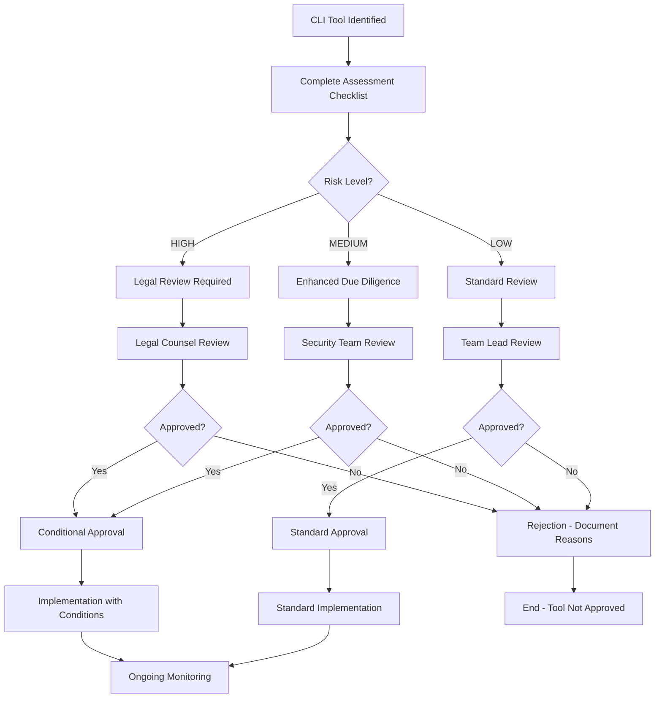

# CLI Integration Legal Compliance Checklist

## Overview

This document provides a comprehensive legal compliance checklist specifically for CLI tool integrations within the Dyad CLI Gateway. It addresses licensing, terms of service, data handling, and regulatory compliance requirements.

## Pre-Integration Legal Review

### ✅ CLI Tool Assessment Checklist

Before integrating any CLI tool, complete this assessment:

#### 1. Tool Identification and Source
- [ ] **Tool Name**: _________________
- [ ] **Version**: _________________
- [ ] **Source/Vendor**: _________________
- [ ] **Official Website**: _________________
- [ ] **Repository URL**: _________________
- [ ] **Maintainer/Organization**: _________________

#### 2. Licensing Review
- [ ] **License Type**: _________________
- [ ] **License Compatibility**: Compatible with our usage ☐ Yes ☐ No
- [ ] **Commercial Use Permitted**: ☐ Yes ☐ No ☐ Restrictions
- [ ] **Redistribution Rights**: ☐ Allowed ☐ Prohibited ☐ Conditions
- [ ] **Attribution Requirements**: ☐ Required ☐ Not Required
- [ ] **Copyleft Requirements**: ☐ None ☐ Weak ☐ Strong
- [ ] **Patent Grants**: ☐ Included ☐ Not Included ☐ Unknown

#### 3. Terms of Service Analysis
- [ ] **TOS Exists**: ☐ Yes ☐ No
- [ ] **TOS Reviewed**: ☐ Yes ☐ No ☐ N/A
- [ ] **Proxy Usage Permitted**: ☐ Explicitly Allowed ☐ Not Prohibited ☐ Prohibited
- [ ] **Commercial Proxy Use**: ☐ Allowed ☐ Restricted ☐ Prohibited
- [ ] **Rate Limiting Requirements**: ☐ None ☐ Specified ☐ Unclear
- [ ] **Data Usage Restrictions**: ☐ None ☐ Specified ☐ Review Required

#### 4. Data Handling Compliance
- [ ] **Data Types Processed**: _________________
- [ ] **PII Handling**: ☐ No PII ☐ PII Processed ☐ PII Stored
- [ ] **Data Retention Policy**: ☐ Defined ☐ Undefined ☐ N/A
- [ ] **Data Location Requirements**: ☐ None ☐ Specified ☐ Restricted
- [ ] **Encryption Requirements**: ☐ None ☐ In Transit ☐ At Rest ☐ Both

## Common CLI Tool Categories

### 1. AI/ML Model CLI Tools

#### OpenAI CLI
```yaml
tool_assessment:
  name: "OpenAI CLI"
  license: "MIT"
  commercial_use: "Permitted"
  tos_compliance: "Must use official API"
  data_handling: "Subject to OpenAI data policy"
  risk_level: "LOW"
  approved: true
  conditions:
    - "Must use official API endpoints only"
    - "Comply with OpenAI usage policies"
    - "Implement proper rate limiting"
```

#### Anthropic Claude CLI
```yaml
tool_assessment:
  name: "Anthropic Claude CLI"
  license: "Proprietary"
  commercial_use: "Check current terms"
  tos_compliance: "Review required"
  data_handling: "Subject to Anthropic policies"
  risk_level: "MEDIUM"
  approved: false
  conditions:
    - "Legal review of current terms required"
    - "Verify proxy usage permissions"
```

#### Google Gemini CLI
```yaml
tool_assessment:
  name: "Google Gemini CLI"
  license: "Varies by tool"
  commercial_use: "Check Google Cloud terms"
  tos_compliance: "Must comply with Google Cloud AI terms"
  data_handling: "Subject to Google Cloud policies"
  risk_level: "MEDIUM"
  approved: false
  conditions:
    - "Use official Google Cloud AI APIs only"
    - "Comply with Google Cloud terms"
```

### 2. Local Model Tools

#### Ollama
```yaml
tool_assessment:
  name: "Ollama"
  license: "MIT"
  commercial_use: "Permitted"
  tos_compliance: "Open source, no TOS restrictions"
  data_handling: "Local processing only"
  risk_level: "LOW"
  approved: true
  conditions:
    - "Verify model licenses separately"
    - "Ensure local data processing"
```

#### Hugging Face Transformers CLI
```yaml
tool_assessment:
  name: "Transformers CLI"
  license: "Apache 2.0"
  commercial_use: "Permitted"
  tos_compliance: "Check individual model licenses"
  data_handling: "Varies by model"
  risk_level: "MEDIUM"
  approved: true
  conditions:
    - "Review each model license individually"
    - "Comply with model-specific terms"
```

### 3. Utility and Processing Tools

#### jq (JSON processor)
```yaml
tool_assessment:
  name: "jq"
  license: "MIT"
  commercial_use: "Permitted"
  tos_compliance: "No restrictions"
  data_handling: "Processing only, no storage"
  risk_level: "LOW"
  approved: true
  conditions: []
```

#### curl
```yaml
tool_assessment:
  name: "curl"
  license: "MIT-style"
  commercial_use: "Permitted"
  tos_compliance: "No restrictions"
  data_handling: "Transport only"
  risk_level: "LOW"
  approved: true
  conditions: []
```

## Regulatory Compliance Requirements

### GDPR Compliance (EU Users)

#### Data Processing Lawfulness
- [ ] **Lawful Basis Identified**: ☐ Consent ☐ Contract ☐ Legitimate Interest
- [ ] **Data Subject Rights**: ☐ Access ☐ Rectification ☐ Erasure ☐ Portability
- [ ] **Privacy Notice Updated**: ☐ Yes ☐ No ☐ N/A
- [ ] **Data Protection Impact Assessment**: ☐ Required ☐ Not Required ☐ Completed

#### Technical and Organizational Measures
```yaml
gdpr_measures:
  data_minimization:
    - "Process only necessary data"
    - "Implement data retention limits"
    - "Regular data purging"
    
  security_measures:
    - "Encryption in transit and at rest"
    - "Access controls and authentication"
    - "Audit logging and monitoring"
    
  accountability:
    - "Document processing activities"
    - "Maintain compliance records"
    - "Regular compliance reviews"
```

### CCPA Compliance (California Users)

#### Consumer Rights
- [ ] **Right to Know**: Data collection disclosure implemented
- [ ] **Right to Delete**: Data deletion mechanism available
- [ ] **Right to Opt-Out**: Opt-out mechanism for data sales
- [ ] **Non-Discrimination**: No discrimination for exercising rights

### Industry-Specific Compliance

#### Healthcare (HIPAA)
```yaml
hipaa_requirements:
  applicability: "Only if processing PHI"
  requirements:
    - "Business Associate Agreement (BAA) required"
    - "Administrative safeguards"
    - "Physical safeguards"
    - "Technical safeguards"
  risk_assessment: "Required if PHI processed"
```

#### Financial Services (SOX, PCI DSS)
```yaml
financial_compliance:
  sox_requirements:
    - "Internal controls documentation"
    - "Audit trail maintenance"
    - "Change management processes"
    
  pci_dss_requirements:
    - "Secure network architecture"
    - "Cardholder data protection"
    - "Regular security testing"
```

## Risk Assessment Matrix

### Risk Levels and Mitigation

#### HIGH RISK - Immediate Legal Review Required
```yaml
high_risk_indicators:
  - "Proprietary CLI tools with unclear licensing"
  - "Tools that may violate vendor TOS"
  - "Processing of sensitive personal data"
  - "Cross-border data transfers"
  - "Reverse-engineered or unofficial tools"

mitigation_strategies:
  - "Legal counsel review mandatory"
  - "Vendor approval required"
  - "Enhanced monitoring and logging"
  - "Regular compliance audits"
  - "Incident response procedures"
```

#### MEDIUM RISK - Enhanced Due Diligence
```yaml
medium_risk_indicators:
  - "Open source tools with copyleft licenses"
  - "Tools with unclear data handling practices"
  - "Third-party hosted services"
  - "Tools with frequent updates/changes"

mitigation_strategies:
  - "Regular license compliance reviews"
  - "Data flow documentation"
  - "Vendor security assessments"
  - "Update impact assessments"
```

#### LOW RISK - Standard Approval Process
```yaml
low_risk_indicators:
  - "Well-established open source tools"
  - "Clear permissive licensing"
  - "Local processing only"
  - "No sensitive data handling"

mitigation_strategies:
  - "Standard approval workflow"
  - "Basic compliance documentation"
  - "Regular usage monitoring"
```

## Approval Workflow

### CLI Tool Integration Approval Process



### Approval Documentation

#### Required Documentation
```yaml
approval_package:
  assessment_checklist: "Completed compliance checklist"
  risk_assessment: "Risk level and mitigation strategies"
  legal_review: "Legal counsel opinion (if required)"
  technical_review: "Security and technical assessment"
  approval_decision: "Final approval with conditions"
  monitoring_plan: "Ongoing compliance monitoring"
```

## Ongoing Compliance Monitoring

### Regular Review Schedule

#### Monthly Reviews
- [ ] **New CLI Tools**: Review any newly integrated tools
- [ ] **License Changes**: Monitor for license updates
- [ ] **TOS Updates**: Check for terms of service changes
- [ ] **Usage Patterns**: Review tool usage for compliance

#### Quarterly Reviews
- [ ] **Comprehensive Audit**: Full compliance review of all tools
- [ ] **Risk Reassessment**: Update risk levels based on changes
- [ ] **Legal Updates**: Review regulatory and legal changes
- [ ] **Documentation Updates**: Update compliance documentation

#### Annual Reviews
- [ ] **Complete Compliance Audit**: Third-party compliance review
- [ ] **Legal Framework Update**: Update legal compliance framework
- [ ] **Training Updates**: Update team training materials
- [ ] **Policy Reviews**: Review and update compliance policies

### Compliance Metrics

#### Key Performance Indicators
```yaml
compliance_kpis:
  tool_compliance_rate:
    target: "100%"
    measurement: "Approved tools / Total tools"
    
  review_completion_rate:
    target: "100%"
    measurement: "Completed reviews / Required reviews"
    
  incident_response_time:
    target: "< 24 hours"
    measurement: "Time to address compliance issues"
    
  training_completion_rate:
    target: "100%"
    measurement: "Staff completing compliance training"
```

## Incident Response for Compliance Issues

### Compliance Violation Response

#### Immediate Actions (0-4 hours)
1. **Assess Severity**: Determine impact and risk level
2. **Contain Issue**: Disable non-compliant tool if necessary
3. **Notify Stakeholders**: Alert legal and management teams
4. **Document Incident**: Create incident record

#### Short-term Actions (4-24 hours)
1. **Investigate Root Cause**: Determine how violation occurred
2. **Legal Consultation**: Engage legal counsel if required
3. **Remediation Plan**: Develop plan to address violation
4. **Communication Plan**: Prepare internal/external communications

#### Long-term Actions (1-30 days)
1. **Implement Remediation**: Execute remediation plan
2. **Process Improvements**: Update processes to prevent recurrence
3. **Training Updates**: Update training based on lessons learned
4. **Compliance Review**: Comprehensive review of related areas

### Regulatory Notification Requirements

#### GDPR Breach Notification
```yaml
gdpr_notification:
  timeline: "72 hours to supervisory authority"
  requirements:
    - "Nature of breach"
    - "Categories and number of data subjects"
    - "Likely consequences"
    - "Measures taken or proposed"
```

#### Other Regulatory Requirements
```yaml
other_notifications:
  ccpa: "Notify California AG if required"
  sox: "Notify auditors of material changes"
  industry_specific: "Follow sector-specific requirements"
```

## Training and Awareness

### Compliance Training Program

#### New Team Member Training
- [ ] **Legal Compliance Overview**: Introduction to compliance requirements
- [ ] **CLI Integration Process**: Step-by-step integration procedures
- [ ] **Risk Assessment**: How to assess legal and compliance risks
- [ ] **Documentation Requirements**: Proper documentation practices

#### Ongoing Training
- [ ] **Quarterly Updates**: Latest legal and regulatory changes
- [ ] **Annual Refresher**: Complete compliance training refresh
- [ ] **Incident-Based Training**: Training following compliance incidents
- [ ] **Role-Specific Training**: Specialized training for different roles

### Compliance Resources

#### Internal Resources
- **Legal Team**: Primary legal guidance and support
- **Compliance Officer**: Day-to-day compliance oversight
- **Security Team**: Technical compliance implementation
- **Documentation**: Centralized compliance documentation

#### External Resources
- **Legal Counsel**: External legal expertise when needed
- **Compliance Consultants**: Specialized compliance guidance
- **Industry Associations**: Industry-specific compliance resources
- **Regulatory Bodies**: Direct guidance from regulators

---

**Document Control**
- **Version**: 1.0
- **Effective Date**: [CURRENT_DATE]
- **Review Date**: [QUARTERLY]
- **Owner**: Legal/Compliance Team
- **Approved By**: [TO BE FILLED]
- **Classification**: CONFIDENTIAL