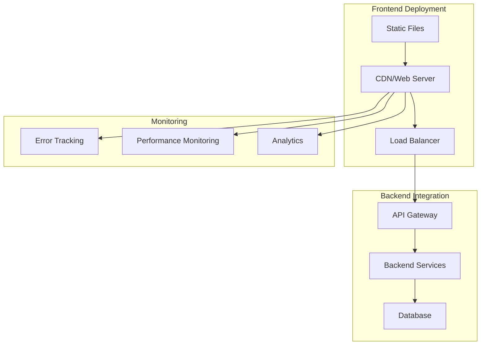

# Deployment Guide

This comprehensive guide covers deploying the Dyad CLI Gateway Admin UI to various environments, from development to production.

## Table of Contents

- [Overview](#overview)
- [Environment Configuration](#environment-configuration)
- [Build Process](#build-process)
- [Docker Deployment](#docker-deployment)
- [Cloud Deployment](#cloud-deployment)
- [CDN and Static Hosting](#cdn-and-static-hosting)
- [CI/CD Pipeline](#cicd-pipeline)
- [Monitoring and Observability](#monitoring-and-observability)
- [Security Considerations](#security-considerations)
- [Performance Optimization](#performance-optimization)
- [Troubleshooting](#troubleshooting)

## Overview

The Dyad CLI Gateway Admin UI is a React-based single-page application (SPA) that can be deployed as static files to various hosting platforms. The application requires proper configuration for different environments and integration with the backend API.

### Deployment Architecture



## Environment Configuration

### Environment Variables

Create environment-specific configuration files:

#### Development (`.env.development`)

```bash
# API Configuration
VITE_API_BASE_URL=http://localhost:3000
VITE_WS_BASE_URL=ws://localhost:3000

# Environment
VITE_ENVIRONMENT=development
NODE_ENV=development

# Feature Flags
VITE_FEATURE_FLAGS_ENABLED=true
VITE_FEATURE_FLAGS_ENDPOINT=/api/v1/feature-flags

# Monitoring (disabled in development)
VITE_SENTRY_DSN=
VITE_PERFORMANCE_MONITORING_ENABLED=false
VITE_ANALYTICS_ENABLED=false

# Debug Settings
VITE_DEBUG_MODE=true
VITE_LOG_LEVEL=debug

# Security (relaxed for development)
VITE_CSRF_ENABLED=false
VITE_SECURE_COOKIES=false

# PWA (disabled in development)
VITE_PWA_ENABLED=false
```

#### Staging (`.env.staging`)

```bash
# API Configuration
VITE_API_BASE_URL=https://staging-api.dyad-cli-gateway.com
VITE_WS_BASE_URL=wss://staging-api.dyad-cli-gateway.com

# Environment
VITE_ENVIRONMENT=staging
NODE_ENV=production

# Feature Flags
VITE_FEATURE_FLAGS_ENABLED=true
VITE_FEATURE_FLAGS_ENDPOINT=/api/v1/feature-flags

# Monitoring
VITE_SENTRY_DSN=https://your-staging-sentry-dsn@sentry.io/project
VITE_PERFORMANCE_MONITORING_ENABLED=true
VITE_PERFORMANCE_SAMPLE_RATE=1.0
VITE_ANALYTICS_ENABLED=true

# Debug Settings
VITE_DEBUG_MODE=false
VITE_LOG_LEVEL=warn

# Security
VITE_CSRF_ENABLED=true
VITE_SECURE_COOKIES=true

# PWA
VITE_PWA_ENABLED=true
```

#### Production (`.env.production`)

```bash
# API Configuration
VITE_API_BASE_URL=https://api.dyad-cli-gateway.com
VITE_WS_BASE_URL=wss://api.dyad-cli-gateway.com

# Environment
VITE_ENVIRONMENT=production
NODE_ENV=production

# Feature Flags
VITE_FEATURE_FLAGS_ENABLED=true
VITE_FEATURE_FLAGS_ENDPOINT=/api/v1/feature-flags

# Monitoring
VITE_SENTRY_DSN=https://your-production-sentry-dsn@sentry.io/project
VITE_PERFORMANCE_MONITORING_ENABLED=true
VITE_PERFORMANCE_SAMPLE_RATE=0.1
VITE_ANALYTICS_ENABLED=true

# Debug Settings
VITE_DEBUG_MODE=false
VITE_LOG_LEVEL=error

# Security
VITE_CSRF_ENABLED=true
VITE_SECURE_COOKIES=true

# PWA
VITE_PWA_ENABLED=true

# CDN Configuration
VITE_CDN_BASE_URL=https://cdn.dyad-cli-gateway.com
VITE_ASSETS_BASE_URL=https://assets.dyad-cli-gateway.com
```

### Configuration Validation

Create a configuration validator:

```typescript
// src/lib/config-validator.ts
import { z } from 'zod';

const configSchema = z.object({
  apiBaseUrl: z.string().url('Invalid API base URL'),
  wsBaseUrl: z.string().url('Invalid WebSocket URL'),
  environment: z.enum(['development', 'staging', 'production']),
  sentryDsn: z.string().optional(),
  performanceMonitoringEnabled: z.boolean(),
  debugMode: z.boolean(),
  csrfEnabled: z.boolean(),
  pwaEnabled: z.boolean(),
});

export const validateConfig = () => {
  const config = {
    apiBaseUrl: import.meta.env.VITE_API_BASE_URL,
    wsBaseUrl: import.meta.env.VITE_WS_BASE_URL,
    environment: import.meta.env.VITE_ENVIRONMENT,
    sentryDsn: import.meta.env.VITE_SENTRY_DSN,
    performanceMonitoringEnabled: import.meta.env.VITE_PERFORMANCE_MONITORING_ENABLED === 'true',
    debugMode: import.meta.env.VITE_DEBUG_MODE === 'true',
    csrfEnabled: import.meta.env.VITE_CSRF_ENABLED === 'true',
    pwaEnabled: import.meta.env.VITE_PWA_ENABLED === 'true',
  };

  try {
    return configSchema.parse(config);
  } catch (error) {
    console.error('Configuration validation failed:', error);
    throw new Error('Invalid configuration');
  }
};
```

## Build Process

### Production Build

```bash
# Install dependencies
npm ci --only=production

# Run type checking
npm run type-check

# Run linting
npm run lint

# Run tests
npm run test:run

# Build for production
npm run build

# Verify build
npm run preview
```

### Build Optimization

#### Vite Configuration for Production

```typescript
// vite.config.ts
import { defineConfig } from 'vite';
import react from '@vitejs/plugin-react-swc';
import { VitePWA } from 'vite-plugin-pwa';
import { visualizer } from 'rollup-plugin-visualizer';

export default defineConfig(({ mode }) => ({
  plugins: [
    react(),
    VitePWA({
      registerType: 'autoUpdate',
      workbox: {
        globPatterns: ['**/*.{js,css,html,ico,png,svg,woff2}'],
        runtimeCaching: [
          {
            urlPattern: /^https:\/\/api\.dyad-cli-gateway\.com\/api\//,
            handler: 'NetworkFirst',
            options: {
              cacheName: 'api-cache',
              expiration: {
                maxEntries: 100,
                maxAgeSeconds: 60 * 60 * 24, // 24 hours
              },
            },
          },
        ],
      },
    }),
    mode === 'analyze' && visualizer({
      filename: 'dist/bundle-analysis.html',
      open: true,
    }),
  ].filter(Boolean),
  
  build: {
    target: 'es2020',
    minify: 'esbuild',
    sourcemap: mode !== 'production',
    rollupOptions: {
      output: {
        manualChunks: {
          // Vendor chunks
          react: ['react', 'react-dom'],
          router: ['react-router-dom'],
          query: ['@tanstack/react-query'],
          ui: [
            '@radix-ui/react-dialog',
            '@radix-ui/react-dropdown-menu',
            '@radix-ui/react-select',
          ],
          
          // Feature chunks
          providers: [
            './src/features/providers',
            './src/hooks/api/use-providers',
          ],
          monitoring: [
            './src/features/monitoring',
            './src/hooks/api/use-system',
          ],
        },
      },
    },
    
    // Chunk size warnings
    chunkSizeWarningLimit: 1000,
  },
  
  // Asset optimization
  assetsInclude: ['**/*.woff2'],
}));
```

#### Bundle Analysis

```bash
# Analyze bundle size
npm run build:analyze

# Generate bundle report
npx vite-bundle-analyzer dist

# Check for duplicate dependencies
npx duplicate-package-checker-webpack-plugin
```

### Build Scripts

Add these scripts to `package.json`:

```json
{
  "scripts": {
    "build": "vite build",
    "build:staging": "vite build --mode staging",
    "build:production": "vite build --mode production",
    "build:analyze": "vite build --mode analyze",
    "build:docker": "docker build -t dyad-frontend .",
    "preview": "vite preview",
    "preview:staging": "vite preview --mode staging",
    "preview:production": "vite preview --mode production"
  }
}
```

## Docker Deployment

### Multi-stage Dockerfile

```dockerfile
# Build stage
FROM node:18-alpine AS builder

WORKDIR /app

# Copy package files
COPY package*.json ./
COPY .npmrc* ./

# Install dependencies
RUN npm ci --only=production --ignore-scripts

# Copy source code
COPY . .

# Build application
ARG BUILD_MODE=production
RUN npm run build:${BUILD_MODE}

# Production stage
FROM nginx:alpine AS production

# Install security updates
RUN apk update && apk upgrade && apk add --no-cache curl

# Copy nginx configuration
COPY nginx.conf /etc/nginx/nginx.conf
COPY nginx-default.conf /etc/nginx/conf.d/default.conf

# Copy built application
COPY --from=builder /app/dist /usr/share/nginx/html

# Add health check
HEALTHCHECK --interval=30s --timeout=3s --start-period=5s --retries=3 \
  CMD curl -f http://localhost:8080/health || exit 1

# Create non-root user
RUN addgroup -g 1001 -S nginx && \
    adduser -S nginx -u 1001

# Set permissions
RUN chown -R nginx:nginx /usr/share/nginx/html && \
    chown -R nginx:nginx /var/cache/nginx && \
    chown -R nginx:nginx /var/log/nginx && \
    chown -R nginx:nginx /etc/nginx/conf.d

# Switch to non-root user
USER nginx

EXPOSE 8080

CMD ["nginx", "-g", "daemon off;"]
```

### Nginx Configuration

#### Main Configuration (`nginx.conf`)

```nginx
user nginx;
worker_processes auto;
error_log /var/log/nginx/error.log warn;
pid /var/run/nginx.pid;

events {
    worker_connections 1024;
    use epoll;
    multi_accept on;
}

http {
    include /etc/nginx/mime.types;
    default_type application/octet-stream;

    # Logging
    log_format main '$remote_addr - $remote_user [$time_local] "$request" '
                    '$status $body_bytes_sent "$http_referer" '
                    '"$http_user_agent" "$http_x_forwarded_for"';
    access_log /var/log/nginx/access.log main;

    # Performance
    sendfile on;
    tcp_nopush on;
    tcp_nodelay on;
    keepalive_timeout 65;
    types_hash_max_size 2048;

    # Gzip compression
    gzip on;
    gzip_vary on;
    gzip_min_length 1024;
    gzip_proxied any;
    gzip_comp_level 6;
    gzip_types
        text/plain
        text/css
        text/xml
        text/javascript
        application/json
        application/javascript
        application/xml+rss
        application/atom+xml
        image/svg+xml;

    # Security headers
    add_header X-Frame-Options DENY always;
    add_header X-Content-Type-Options nosniff always;
    add_header X-XSS-Protection "1; mode=block" always;
    add_header Referrer-Policy "strict-origin-when-cross-origin" always;

    # Include server configurations
    include /etc/nginx/conf.d/*.conf;
}
```

#### Server Configuration (`nginx-default.conf`)

```nginx
server {
    listen 8080;
    server_name _;
    root /usr/share/nginx/html;
    index index.html;

    # Security headers
    add_header Content-Security-Policy "default-src 'self'; script-src 'self' 'unsafe-inline' 'unsafe-eval'; style-src 'self' 'unsafe-inline'; img-src 'self' data: https:; connect-src 'self' https: wss:; font-src 'self' data:;" always;
    add_header Strict-Transport-Security "max-age=31536000; includeSubDomains" always;

    # Caching for static assets
    location ~* \.(js|css|png|jpg|jpeg|gif|ico|svg|woff|woff2|ttf|eot)$ {
        expires 1y;
        add_header Cache-Control "public, immutable";
        add_header X-Content-Type-Options nosniff;
    }

    # API proxy (if needed)
    location /api/ {
        proxy_pass http://backend:3000;
        proxy_http_version 1.1;
        proxy_set_header Upgrade $http_upgrade;
        proxy_set_header Connection 'upgrade';
        proxy_set_header Host $host;
        proxy_set_header X-Real-IP $remote_addr;
        proxy_set_header X-Forwarded-For $proxy_add_x_forwarded_for;
        proxy_set_header X-Forwarded-Proto $scheme;
        proxy_cache_bypass $http_upgrade;
    }

    # WebSocket proxy
    location /ws {
        proxy_pass http://backend:3000;
        proxy_http_version 1.1;
        proxy_set_header Upgrade $http_upgrade;
        proxy_set_header Connection "upgrade";
        proxy_set_header Host $host;
        proxy_set_header X-Real-IP $remote_addr;
        proxy_set_header X-Forwarded-For $proxy_add_x_forwarded_for;
        proxy_set_header X-Forwarded-Proto $scheme;
    }

    # Health check endpoint
    location /health {
        access_log off;
        return 200 "healthy\n";
        add_header Content-Type text/plain;
    }

    # SPA routing - serve index.html for all routes
    location / {
        try_files $uri $uri/ /index.html;
        add_header Cache-Control "no-cache, no-store, must-revalidate";
        add_header Pragma "no-cache";
        add_header Expires "0";
    }

    # Security - deny access to hidden files
    location ~ /\. {
        deny all;
        access_log off;
        log_not_found off;
    }
}
```

### Docker Compose

#### Development (`docker-compose.dev.yml`)

```yaml
version: '3.8'

services:
  frontend:
    build:
      context: .
      dockerfile: Dockerfile
      args:
        BUILD_MODE: development
    ports:
      - "8080:8080"
    environment:
      - NODE_ENV=development
    volumes:
      - ./src:/app/src
      - ./public:/app/public
    depends_on:
      - backend
    networks:
      - dyad-network

  backend:
    image: dyad-backend:latest
    ports:
      - "3000:3000"
    environment:
      - NODE_ENV=development
    networks:
      - dyad-network

networks:
  dyad-network:
    driver: bridge
```

#### Production (`docker-compose.prod.yml`)

```yaml
version: '3.8'

services:
  frontend:
    build:
      context: .
      dockerfile: Dockerfile
      args:
        BUILD_MODE: production
    ports:
      - "80:8080"
      - "443:8080"
    environment:
      - NODE_ENV=production
    restart: unless-stopped
    healthcheck:
      test: ["CMD", "curl", "-f", "http://localhost:8080/health"]
      interval: 30s
      timeout: 10s
      retries: 3
      start_period: 40s
    depends_on:
      - backend
    networks:
      - dyad-network
    labels:
      - "traefik.enable=true"
      - "traefik.http.routers.frontend.rule=Host(`admin.dyad-cli-gateway.com`)"
      - "traefik.http.routers.frontend.tls=true"
      - "traefik.http.routers.frontend.tls.certresolver=letsencrypt"

  backend:
    image: dyad-backend:latest
    environment:
      - NODE_ENV=production
    restart: unless-stopped
    networks:
      - dyad-network

networks:
  dyad-network:
    driver: bridge
```

### Docker Commands

```bash
# Build image
docker build -t dyad-frontend:latest .

# Build with specific mode
docker build --build-arg BUILD_MODE=staging -t dyad-frontend:staging .

# Run container
docker run -p 8080:8080 dyad-frontend:latest

# Run with environment variables
docker run -p 8080:8080 -e NODE_ENV=production dyad-frontend:latest

# Docker Compose
docker-compose -f docker-compose.prod.yml up -d

# View logs
docker-compose -f docker-compose.prod.yml logs -f frontend

# Scale services
docker-compose -f docker-compose.prod.yml up -d --scale frontend=3
```

## Cloud Deployment

### AWS Deployment

#### S3 + CloudFront

```bash
# Install AWS CLI
aws configure

# Create S3 bucket
aws s3 mb s3://dyad-admin-ui-prod

# Enable static website hosting
aws s3 website s3://dyad-admin-ui-prod --index-document index.html --error-document index.html

# Upload build files
aws s3 sync dist/ s3://dyad-admin-ui-prod --delete

# Create CloudFront distribution
aws cloudfront create-distribution --distribution-config file://cloudfront-config.json
```

CloudFront Configuration (`cloudfront-config.json`):

```json
{
  "CallerReference": "dyad-admin-ui-prod-2024",
  "Comment": "Dyad CLI Gateway Admin UI",
  "DefaultRootObject": "index.html",
  "Origins": {
    "Quantity": 1,
    "Items": [
      {
        "Id": "S3-dyad-admin-ui-prod",
        "DomainName": "dyad-admin-ui-prod.s3.amazonaws.com",
        "S3OriginConfig": {
          "OriginAccessIdentity": ""
        }
      }
    ]
  },
  "DefaultCacheBehavior": {
    "TargetOriginId": "S3-dyad-admin-ui-prod",
    "ViewerProtocolPolicy": "redirect-to-https",
    "MinTTL": 0,
    "ForwardedValues": {
      "QueryString": false,
      "Cookies": {
        "Forward": "none"
      }
    }
  },
  "CustomErrorResponses": {
    "Quantity": 1,
    "Items": [
      {
        "ErrorCode": 404,
        "ResponsePagePath": "/index.html",
        "ResponseCode": "200",
        "ErrorCachingMinTTL": 300
      }
    ]
  },
  "Enabled": true,
  "PriceClass": "PriceClass_100"
}
```

#### ECS Deployment

```yaml
# ecs-task-definition.json
{
  "family": "dyad-frontend",
  "networkMode": "awsvpc",
  "requiresCompatibilities": ["FARGATE"],
  "cpu": "256",
  "memory": "512",
  "executionRoleArn": "arn:aws:iam::ACCOUNT:role/ecsTaskExecutionRole",
  "containerDefinitions": [
    {
      "name": "dyad-frontend",
      "image": "your-account.dkr.ecr.region.amazonaws.com/dyad-frontend:latest",
      "portMappings": [
        {
          "containerPort": 8080,
          "protocol": "tcp"
        }
      ],
      "essential": true,
      "logConfiguration": {
        "logDriver": "awslogs",
        "options": {
          "awslogs-group": "/ecs/dyad-frontend",
          "awslogs-region": "us-east-1",
          "awslogs-stream-prefix": "ecs"
        }
      },
      "environment": [
        {
          "name": "NODE_ENV",
          "value": "production"
        }
      ]
    }
  ]
}
```

### Google Cloud Platform

#### Cloud Storage + Cloud CDN

```bash
# Create bucket
gsutil mb gs://dyad-admin-ui-prod

# Upload files
gsutil -m rsync -r -d dist/ gs://dyad-admin-ui-prod

# Set bucket permissions
gsutil iam ch allUsers:objectViewer gs://dyad-admin-ui-prod

# Configure website
gsutil web set -m index.html -e index.html gs://dyad-admin-ui-prod
```

#### Cloud Run

```yaml
# cloudbuild.yaml
steps:
  - name: 'gcr.io/cloud-builders/docker'
    args: ['build', '-t', 'gcr.io/$PROJECT_ID/dyad-frontend', '.']
  - name: 'gcr.io/cloud-builders/docker'
    args: ['push', 'gcr.io/$PROJECT_ID/dyad-frontend']
  - name: 'gcr.io/cloud-builders/gcloud'
    args:
      - 'run'
      - 'deploy'
      - 'dyad-frontend'
      - '--image'
      - 'gcr.io/$PROJECT_ID/dyad-frontend'
      - '--region'
      - 'us-central1'
      - '--platform'
      - 'managed'
      - '--allow-unauthenticated'
```

### Azure Deployment

#### Static Web Apps

```yaml
# .github/workflows/azure-static-web-apps.yml
name: Azure Static Web Apps CI/CD

on:
  push:
    branches:
      - main
  pull_request:
    types: [opened, synchronize, reopened, closed]
    branches:
      - main

jobs:
  build_and_deploy_job:
    if: github.event_name == 'push' || (github.event_name == 'pull_request' && github.event.action != 'closed')
    runs-on: ubuntu-latest
    name: Build and Deploy Job
    steps:
      - uses: actions/checkout@v3
        with:
          submodules: true
      - name: Build And Deploy
        id: builddeploy
        uses: Azure/static-web-apps-deploy@v1
        with:
          azure_static_web_apps_api_token: ${{ secrets.AZURE_STATIC_WEB_APPS_API_TOKEN }}
          repo_token: ${{ secrets.GITHUB_TOKEN }}
          action: "upload"
          app_location: "/"
          api_location: ""
          output_location: "dist"
```

## CDN and Static Hosting

### Netlify

Create `netlify.toml`:

```toml
[build]
  publish = "dist"
  command = "npm run build"

[build.environment]
  NODE_VERSION = "18"

[[redirects]]
  from = "/*"
  to = "/index.html"
  status = 200

[[headers]]
  for = "/*"
  [headers.values]
    X-Frame-Options = "DENY"
    X-XSS-Protection = "1; mode=block"
    X-Content-Type-Options = "nosniff"
    Referrer-Policy = "strict-origin-when-cross-origin"

[[headers]]
  for = "/static/*"
  [headers.values]
    Cache-Control = "public, max-age=31536000, immutable"
```

### Vercel

Create `vercel.json`:

```json
{
  "buildCommand": "npm run build",
  "outputDirectory": "dist",
  "framework": "vite",
  "rewrites": [
    {
      "source": "/(.*)",
      "destination": "/index.html"
    }
  ],
  "headers": [
    {
      "source": "/(.*)",
      "headers": [
        {
          "key": "X-Frame-Options",
          "value": "DENY"
        },
        {
          "key": "X-Content-Type-Options",
          "value": "nosniff"
        },
        {
          "key": "X-XSS-Protection",
          "value": "1; mode=block"
        }
      ]
    },
    {
      "source": "/static/(.*)",
      "headers": [
        {
          "key": "Cache-Control",
          "value": "public, max-age=31536000, immutable"
        }
      ]
    }
  ]
}
```

### GitHub Pages

Create `.github/workflows/deploy.yml`:

```yaml
name: Deploy to GitHub Pages

on:
  push:
    branches: [ main ]

jobs:
  build-and-deploy:
    runs-on: ubuntu-latest
    steps:
      - name: Checkout
        uses: actions/checkout@v3

      - name: Setup Node.js
        uses: actions/setup-node@v3
        with:
          node-version: '18'
          cache: 'npm'

      - name: Install dependencies
        run: npm ci

      - name: Build
        run: npm run build
        env:
          VITE_API_BASE_URL: ${{ secrets.VITE_API_BASE_URL }}

      - name: Deploy
        uses: peaceiris/actions-gh-pages@v3
        with:
          github_token: ${{ secrets.GITHUB_TOKEN }}
          publish_dir: ./dist
```

## CI/CD Pipeline

### GitHub Actions

Create `.github/workflows/ci-cd.yml`:

```yaml
name: CI/CD Pipeline

on:
  push:
    branches: [ main, develop ]
  pull_request:
    branches: [ main ]

env:
  NODE_VERSION: '18'

jobs:
  test:
    runs-on: ubuntu-latest
    steps:
      - uses: actions/checkout@v3

      - name: Setup Node.js
        uses: actions/setup-node@v3
        with:
          node-version: ${{ env.NODE_VERSION }}
          cache: 'npm'

      - name: Install dependencies
        run: npm ci

      - name: Run type checking
        run: npm run type-check

      - name: Run linting
        run: npm run lint

      - name: Run tests
        run: npm run test:run

      - name: Run accessibility tests
        run: npm run test:a11y

      - name: Upload coverage
        uses: codecov/codecov-action@v3
        with:
          file: ./coverage/lcov.info

  build:
    needs: test
    runs-on: ubuntu-latest
    strategy:
      matrix:
        environment: [staging, production]
    steps:
      - uses: actions/checkout@v3

      - name: Setup Node.js
        uses: actions/setup-node@v3
        with:
          node-version: ${{ env.NODE_VERSION }}
          cache: 'npm'

      - name: Install dependencies
        run: npm ci

      - name: Build for ${{ matrix.environment }}
        run: npm run build:${{ matrix.environment }}
        env:
          VITE_API_BASE_URL: ${{ secrets[format('VITE_API_BASE_URL_{0}', upper(matrix.environment))] }}
          VITE_SENTRY_DSN: ${{ secrets[format('VITE_SENTRY_DSN_{0}', upper(matrix.environment))] }}

      - name: Upload build artifacts
        uses: actions/upload-artifact@v3
        with:
          name: build-${{ matrix.environment }}
          path: dist/

  deploy-staging:
    needs: build
    runs-on: ubuntu-latest
    if: github.ref == 'refs/heads/develop'
    environment: staging
    steps:
      - name: Download build artifacts
        uses: actions/download-artifact@v3
        with:
          name: build-staging
          path: dist/

      - name: Deploy to staging
        run: |
          # Deploy to staging environment
          echo "Deploying to staging..."

  deploy-production:
    needs: build
    runs-on: ubuntu-latest
    if: github.ref == 'refs/heads/main'
    environment: production
    steps:
      - name: Download build artifacts
        uses: actions/download-artifact@v3
        with:
          name: build-production
          path: dist/

      - name: Deploy to production
        run: |
          # Deploy to production environment
          echo "Deploying to production..."

  security-scan:
    runs-on: ubuntu-latest
    steps:
      - uses: actions/checkout@v3

      - name: Run security audit
        run: npm audit --audit-level high

      - name: Run Snyk security scan
        uses: snyk/actions/node@master
        env:
          SNYK_TOKEN: ${{ secrets.SNYK_TOKEN }}
```

### GitLab CI/CD

Create `.gitlab-ci.yml`:

```yaml
stages:
  - test
  - build
  - deploy

variables:
  NODE_VERSION: "18"

cache:
  paths:
    - node_modules/

test:
  stage: test
  image: node:$NODE_VERSION
  script:
    - npm ci
    - npm run type-check
    - npm run lint
    - npm run test:run
    - npm run test:a11y
  coverage: '/Lines\s*:\s*(\d+\.\d+)%/'
  artifacts:
    reports:
      coverage_report:
        coverage_format: cobertura
        path: coverage/cobertura-coverage.xml

build:staging:
  stage: build
  image: node:$NODE_VERSION
  script:
    - npm ci
    - npm run build:staging
  artifacts:
    paths:
      - dist/
    expire_in: 1 hour
  only:
    - develop

build:production:
  stage: build
  image: node:$NODE_VERSION
  script:
    - npm ci
    - npm run build:production
  artifacts:
    paths:
      - dist/
    expire_in: 1 hour
  only:
    - main

deploy:staging:
  stage: deploy
  image: alpine:latest
  script:
    - echo "Deploying to staging..."
    # Add deployment commands
  environment:
    name: staging
    url: https://staging-admin.dyad-cli-gateway.com
  only:
    - develop

deploy:production:
  stage: deploy
  image: alpine:latest
  script:
    - echo "Deploying to production..."
    # Add deployment commands
  environment:
    name: production
    url: https://admin.dyad-cli-gateway.com
  when: manual
  only:
    - main
```

## Monitoring and Observability

### Error Tracking with Sentry

```typescript
// src/lib/sentry.ts
import * as Sentry from '@sentry/react';
import { BrowserTracing } from '@sentry/tracing';

export const initSentry = () => {
  if (!import.meta.env.VITE_SENTRY_DSN) {
    console.warn('Sentry DSN not configured');
    return;
  }

  Sentry.init({
    dsn: import.meta.env.VITE_SENTRY_DSN,
    environment: import.meta.env.VITE_ENVIRONMENT,
    integrations: [
      new BrowserTracing({
        routingInstrumentation: Sentry.reactRouterV6Instrumentation(
          React.useEffect,
          useLocation,
          useNavigationType,
          createRoutesFromChildren,
          matchRoutes
        ),
      }),
    ],
    tracesSampleRate: import.meta.env.VITE_ENVIRONMENT === 'production' ? 0.1 : 1.0,
    beforeSend(event) {
      // Filter out development errors
      if (import.meta.env.DEV) {
        return null;
      }
      return event;
    },
  });
};

// Error boundary with Sentry
export const SentryErrorBoundary = Sentry.withErrorBoundary(App, {
  fallback: ({ error, resetError }) => (
    <div className="min-h-screen flex items-center justify-center">
      <div className="text-center">
        <h1 className="text-2xl font-bold mb-4">Something went wrong</h1>
        <p className="text-muted-foreground mb-4">{error.message}</p>
        <Button onClick={resetError}>Try again</Button>
      </div>
    </div>
  ),
});
```

### Performance Monitoring

```typescript
// src/lib/performance-monitoring.ts
import { getCLS, getFID, getFCP, getLCP, getTTFB } from 'web-vitals';

export const initPerformanceMonitoring = () => {
  if (!import.meta.env.VITE_PERFORMANCE_MONITORING_ENABLED) {
    return;
  }

  const sendToAnalytics = (metric: any) => {
    // Send to your analytics service
    console.log('Performance metric:', metric);
    
    // Example: Send to Google Analytics
    if (typeof gtag !== 'undefined') {
      gtag('event', metric.name, {
        event_category: 'Web Vitals',
        event_label: metric.id,
        value: Math.round(metric.name === 'CLS' ? metric.value * 1000 : metric.value),
        non_interaction: true,
      });
    }
  };

  getCLS(sendToAnalytics);
  getFID(sendToAnalytics);
  getFCP(sendToAnalytics);
  getLCP(sendToAnalytics);
  getTTFB(sendToAnalytics);
};
```

### Health Check Endpoint

Create a health check for monitoring:

```typescript
// src/lib/health-check.ts
export interface HealthStatus {
  status: 'healthy' | 'unhealthy';
  timestamp: string;
  version: string;
  environment: string;
  checks: {
    api: boolean;
    websocket: boolean;
    localStorage: boolean;
  };
}

export const performHealthCheck = async (): Promise<HealthStatus> => {
  const checks = {
    api: await checkApiHealth(),
    websocket: await checkWebSocketHealth(),
    localStorage: checkLocalStorageHealth(),
  };

  const allHealthy = Object.values(checks).every(Boolean);

  return {
    status: allHealthy ? 'healthy' : 'unhealthy',
    timestamp: new Date().toISOString(),
    version: import.meta.env.VITE_APP_VERSION || '1.0.0',
    environment: import.meta.env.VITE_ENVIRONMENT,
    checks,
  };
};

const checkApiHealth = async (): Promise<boolean> => {
  try {
    const response = await fetch(`${import.meta.env.VITE_API_BASE_URL}/api/v1/system/health`);
    return response.ok;
  } catch {
    return false;
  }
};

const checkWebSocketHealth = async (): Promise<boolean> => {
  return new Promise((resolve) => {
    try {
      const ws = new WebSocket(import.meta.env.VITE_WS_BASE_URL);
      ws.onopen = () => {
        ws.close();
        resolve(true);
      };
      ws.onerror = () => resolve(false);
      setTimeout(() => resolve(false), 5000);
    } catch {
      resolve(false);
    }
  });
};

const checkLocalStorageHealth = (): boolean => {
  try {
    const testKey = '__health_check__';
    localStorage.setItem(testKey, 'test');
    localStorage.removeItem(testKey);
    return true;
  } catch {
    return false;
  }
};
```

## Security Considerations

### Content Security Policy

```html
<!-- In index.html -->
<meta http-equiv="Content-Security-Policy" content="
  default-src 'self';
  script-src 'self' 'unsafe-inline' 'unsafe-eval' https://cdn.jsdelivr.net;
  style-src 'self' 'unsafe-inline' https://fonts.googleapis.com;
  img-src 'self' data: https:;
  font-src 'self' https://fonts.gstatic.com;
  connect-src 'self' https: wss:;
  frame-ancestors 'none';
  base-uri 'self';
  form-action 'self';
">
```

### Security Headers

```nginx
# In nginx configuration
add_header Strict-Transport-Security "max-age=31536000; includeSubDomains; preload" always;
add_header X-Frame-Options "DENY" always;
add_header X-Content-Type-Options "nosniff" always;
add_header X-XSS-Protection "1; mode=block" always;
add_header Referrer-Policy "strict-origin-when-cross-origin" always;
add_header Permissions-Policy "geolocation=(), microphone=(), camera=()" always;
```

### Environment Variable Security

```bash
# Never commit these to version control
VITE_SENTRY_DSN=https://your-sentry-dsn@sentry.io/project
VITE_API_KEY=your-api-key
VITE_ANALYTICS_ID=your-analytics-id

# Use secrets management in CI/CD
# GitHub Actions: ${{ secrets.VITE_SENTRY_DSN }}
# GitLab CI: $VITE_SENTRY_DSN (protected variable)
# AWS: Parameter Store or Secrets Manager
```

## Performance Optimization

### Bundle Optimization

```typescript
// vite.config.ts - Advanced optimization
export default defineConfig({
  build: {
    rollupOptions: {
      output: {
        manualChunks: (id) => {
          // Vendor chunks
          if (id.includes('node_modules')) {
            if (id.includes('react') || id.includes('react-dom')) {
              return 'react';
            }
            if (id.includes('@radix-ui')) {
              return 'radix';
            }
            if (id.includes('@tanstack')) {
              return 'tanstack';
            }
            return 'vendor';
          }
          
          // Feature chunks
          if (id.includes('src/features/providers')) {
            return 'providers';
          }
          if (id.includes('src/features/monitoring')) {
            return 'monitoring';
          }
        },
      },
    },
  },
  
  // Optimize dependencies
  optimizeDeps: {
    include: ['react', 'react-dom', '@tanstack/react-query'],
    exclude: ['@vite/client', '@vite/env'],
  },
});
```

### Caching Strategy

```typescript
// Service Worker caching
const CACHE_NAME = 'dyad-admin-ui-v1';
const STATIC_ASSETS = [
  '/',
  '/static/js/main.js',
  '/static/css/main.css',
  '/manifest.json',
];

self.addEventListener('install', (event) => {
  event.waitUntil(
    caches.open(CACHE_NAME)
      .then((cache) => cache.addAll(STATIC_ASSETS))
  );
});

self.addEventListener('fetch', (event) => {
  if (event.request.url.includes('/api/')) {
    // Network first for API calls
    event.respondWith(
      fetch(event.request)
        .then((response) => {
          const responseClone = response.clone();
          caches.open(CACHE_NAME)
            .then((cache) => cache.put(event.request, responseClone));
          return response;
        })
        .catch(() => caches.match(event.request))
    );
  } else {
    // Cache first for static assets
    event.respondWith(
      caches.match(event.request)
        .then((response) => response || fetch(event.request))
    );
  }
});
```

## Troubleshooting

### Common Deployment Issues

#### Build Failures

```bash
# Clear cache and rebuild
rm -rf node_modules dist .vite
npm install
npm run build

# Check for TypeScript errors
npm run type-check

# Check for linting errors
npm run lint
```

#### Environment Variable Issues

```bash
# Verify environment variables are loaded
npm run build -- --mode production
# Check the built files for correct API URLs

# Debug environment loading
console.log('Environment:', import.meta.env);
```

#### Docker Issues

```bash
# Check Docker build
docker build --no-cache -t dyad-frontend .

# Debug container
docker run -it --entrypoint /bin/sh dyad-frontend

# Check nginx configuration
docker exec -it container_name nginx -t
```

#### Performance Issues

```bash
# Analyze bundle size
npm run build:analyze

# Check for large dependencies
npx webpack-bundle-analyzer dist/assets/*.js

# Monitor runtime performance
# Enable performance monitoring in browser DevTools
```

### Monitoring and Alerts

Set up alerts for:

- **Build failures** in CI/CD
- **High error rates** in Sentry
- **Poor performance metrics** (Core Web Vitals)
- **Failed health checks**
- **High memory usage**
- **SSL certificate expiration**

### Rollback Procedures

```bash
# Quick rollback using Docker tags
docker pull dyad-frontend:previous-version
docker stop dyad-frontend-current
docker run -d --name dyad-frontend-rollback dyad-frontend:previous-version

# Rollback using Git
git checkout previous-working-commit
npm run build
# Deploy the previous version

# Rollback using CDN
# Point CDN to previous S3 bucket or version
aws cloudfront create-invalidation --distribution-id DISTRIBUTION_ID --paths "/*"
```

This deployment guide provides comprehensive coverage of deploying the Dyad CLI Gateway Admin UI across various environments and platforms. Choose the deployment strategy that best fits your infrastructure and requirements.